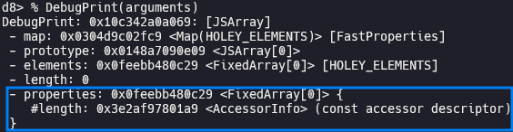
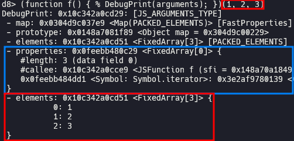
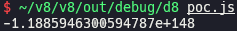
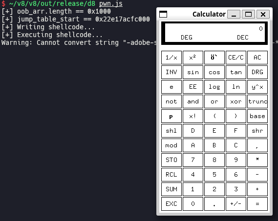

# CVE-2019-5782 (Inappropriate Implementation in V8)

In this post, I will analyze and exploit CVE-2019-5782, a Tianfu Cup winning bug in V8.

## Setup

- Ubuntu 20.04.6 LTS
- [18b28402118b7918512c3e5b6bc5c6f348d43564](https://chromium.googlesource.com/v8/v8.git/+/18b28402118b7918512c3e5b6bc5c6f348d43564) (Nov 22nd, 2018)

Save [`dcheck.diff`](./dcheck.diff) and [`setup.zsh`](./setup.zsh) in your working directory and run `setup.zsh`.

## Analysis

### Root cause

[`arguments`](https://developer.mozilla.org/docs/Web/JavaScript/Reference/Functions/arguments) is an array-like object consisted of the arguments of function.

It has `length` property by default because it is an array-like object, and it additionally has `callee` and `Symbol.iterator` inside a function.

When Turbofan compiles a function, `arguments.length` is optimized by [`Typer::Visitor::TypeArgumentsLength()`](https://source.chromium.org/chromium/v8/v8/+/18b28402118b7918512c3e5b6bc5c6f348d43564:src/compiler/typer.cc;l=2215). The maximum number of arguments of a function is defined as [`kMaxArguments`](https://source.chromium.org/chromium/v8/v8/+/18b28402118b7918512c3e5b6bc5c6f348d43564:src/objects/code.h;l=435), so type of `arguments.length` is predetermined as [`kArgumentsLengthType`](https://source.chromium.org/chromium/v8/v8/+/18b28402118b7918512c3e5b6bc5c6f348d43564:src/compiler/type-cache.h;l=169) for efficiency, the minimum to be `0.0` and the maximum to be `kMaxArguments`.

However, unsurprisingly, we can pass more than `kMaxArguments` arguments to function. In such a case, Speculated type is wrong and this can cause out of bounds access.

### Proof of concept

When Turbofan compiles `f()` in [`poc.js`](./poc.js), it assumes that the maximum value of `idx` is 0 because `kMaxArguments >> 16` equals 0. However, when we lastly call `f()` passing `0x10000` arguments, the actual value of `arguments.length >> 16` is 1.

Under normal circumstances, we can't access out of bounds of an array because of `CheckBounds` node. It performs bounds check by comparing the actual value of index and length.

[`VisitCheckBounds()`](https://source.chromium.org/chromium/v8/v8/+/18b28402118b7918512c3e5b6bc5c6f348d43564:src/compiler/simplified-lowering.cc;l=1523) is called when Turbofan visits `CheckBounds` node. It removes the node by [calling `DeferReplacement()`](https://source.chromium.org/chromium/v8/v8/+/18b28402118b7918512c3e5b6bc5c6f348d43564:src/compiler/simplified-lowering.cc;l=1542) if the maximum value of `index_type` is lower than the minimum value of `length_type`, which means that there is no possibility of out of bounds access. In case of `poc.js`, the maximum value of `idx` is 0 (for Turbofan) and the minimum value of length of `arr` is 1, so it satisfied the condition. As a result, `CheckBounds` is gone and we can achieve out of bounds access.

### Patch

> [[turbofan] Relax range for arguments object length](https://chromium.googlesource.com/v8/v8.git/+/8e4588915ba7a9d9d744075781cea114d49f0c7b) (Nov 30th, 2018)

## Exploitation

We can [generate OOB array](./pwn.js#L37) using OOB write, and implement [`addrof`](./pwn.js#L51), [AAR](./pwn.js#L57)/[AAW](./pwn.js#L65) primitives using OOB array.

> [Escaping V8 Sandbox via ArrayBuffer and WebAssembly Jump Table (Chromium < 100.0.4896.60)](https://aaronsjcho.github.io/Escaping-V8-Sandbox-via-ArrayBuffer-and-WebAssembly-Jump-Table/)

Although there is no sandbox in this version of V8, we can execute shellcode following the same exploitation flow explained in the post above.

[`pwn.wat`](./pwn.wat) [`shellcode.py`](./shellcode.py) [`wasm.py`](./wasm.py)

You have to install `/bin/xcalc` via `sudo apt install -y x11-apps` before running [`pwn.js`](./pwn.js) if you are using WSL.

## References

- [Stable Channel Update for Desktop (Tuesday, January 29, 2019) - Chrome Releases](https://chromereleases.googleblog.com/2019/01/stable-channel-update-for-desktop.html)
- [Security: Tianfu CUP RCE - Chromium Issues](https://issues.chromium.org/issues/40093090)
- [In-the-Wild Series: Chrome Exploits - Project Zero](https://googleprojectzero.blogspot.com/2021/01/in-wild-series-chrome-exploits.html)
