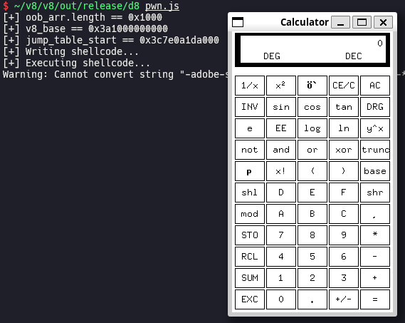

# CVE-2020-6418 (Type Confusion in V8)

In this post, I will analyze and exploit CVE-2020-6418, which is an in-the-wild bug in V8. We can let Turbofan make incorrect assumption while optimization a function, trigger type confusion and get RCE.

## Setup

- Ubuntu 20.04.6 LTS (WSL)
- [bdaa7d66a37adcc1f1d81c9b0f834327a74ffe07](https://chromium.googlesource.com/v8/v8.git/+/bdaa7d66a37adcc1f1d81c9b0f834327a74ffe07) (Feb 19th, 2020)

Save [`dcheck.diff`](./dcheck.diff) and [`setup.zsh`](./setup.zsh) in your working directory and run `setup.zsh`.

## Analysis

### Map inference in Turbofan

[`MapInference`](https://source.chromium.org/chromium/v8/v8/+/bdaa7d66a37adcc1f1d81c9b0f834327a74ffe07:src/compiler/map-inference.h;l=35) class is responsible for inferring map of a specific object. It stores the object in [`object_`](https://source.chromium.org/chromium/v8/v8/+/bdaa7d66a37adcc1f1d81c9b0f834327a74ffe07:src/compiler/map-inference.h;l=83), and stores inferred maps which the object can have in run-time in [`maps_`](https://source.chromium.org/chromium/v8/v8/+/bdaa7d66a37adcc1f1d81c9b0f834327a74ffe07:src/compiler/map-inference.h;l=85).

[Constructor of `MapInference` class](https://source.chromium.org/chromium/v8/v8/+/bdaa7d66a37adcc1f1d81c9b0f834327a74ffe07:src/compiler/map-inference.cc;l=18) calls [`NodeProperties::InferReceiverMapsUnsafe()`](https://source.chromium.org/chromium/v8/v8/+/bdaa7d66a37adcc1f1d81c9b0f834327a74ffe07:src/compiler/node-properties.cc;l=337) and stores its return value in [`result`](https://source.chromium.org/chromium/v8/v8/+/bdaa7d66a37adcc1f1d81c9b0f834327a74ffe07:src/compiler/map-inference.cc;l=21). `NodeProperties::InferReceiverMapsUnsafe()` stores inferred maps in [`maps_return`](https://source.chromium.org/chromium/v8/v8/+/bdaa7d66a37adcc1f1d81c9b0f834327a74ffe07:src/compiler/node-properties.cc;l=339) following effect chain of `object_`, which is set of all nodes which can affect to the state of `object_`. In addition, it checks if any side effect can occur, which means that there is any possibility of deviating from the result of map inference. If no side effect is expected, [`kReliableReceiverMaps`](https://source.chromium.org/chromium/v8/v8/+/bdaa7d66a37adcc1f1d81c9b0f834327a74ffe07:src/compiler/node-properties.h;l=188) is returned. Else, [`kUnreliableReceiverMaps`](https://source.chromium.org/chromium/v8/v8/+/bdaa7d66a37adcc1f1d81c9b0f834327a74ffe07:src/compiler/node-properties.h;l=189) is returned. In the latter case, Turbofan prevents type confusion by inserting `CheckMaps` node or code dependency to optimized code.

### Root cause

When `NodeProperties::InferReceiverMapsUnsafe()` handles [`JSCreate`](https://source.chromium.org/chromium/v8/v8/+/bdaa7d66a37adcc1f1d81c9b0f834327a74ffe07:src/compiler/node-properties.cc;l=379) node, it never set `result` to `kUnreliableReceiverMaps`, which means that there is no possibility of side effect from the viewpoint of Turbofan. However, If we pass [`proxy`](https://developer.mozilla.org/docs/Web/JavaScript/Reference/Global_Objects/Proxy) object to the third argument (`newTarget`) of [`Reflect.construct()`](https://developer.mozilla.org/docs/Web/JavaScript/Reference/Global_Objects/Reflect/construct), side effect which changes map of any object can occur because of getter redefined in `Proxy`. Turbofan overlooks this, so type confusion can be caused.

### Proof of concept

[`poc.js`](./poc.js)

`NodeProperties::InferReceiverMapsUnsafe()` returns `kReliableReceiverMaps`, so Turbofan fully trusts the result of map inference, which is `HOLEY_SMI_ELEMENTS`. Map of `arr` is changed to `HOLEY_DOUBLE_ELEMENTS` inside of getter of `Proxy`, but Turbofan still thinks that `arr` is an array of `SMI`s. As a result, when we try to get `arr.pop()` by calling `ff(p)`, Turbofan accesses to elements of `arr` and gets us an `SMI`.

### Patch

> [[turbofan] Fix bug in receiver maps inference](https://chromium.googlesource.com/v8/v8.git/+/fb0a60e15695466621cf65932f9152935d859447) (Feb 19th, 2020)
>
> JSCreate can have side effects (by looking up the prototype on an object), so once we walk past that the analysis result must be marked as "unreliable".

## Exploitation

### Generate OOB array

In reverse of `poc.js`, we can reduce element size of `arr` in getter of `Proxy`, then we can access out of bounds of `arr`. Using this small OOB write, we can overwrite length of `arr` with a bigger value to generate an OOB array.

### Escape V8 sandbox to get RCE

> [Escaping V8 Sandbox via ArrayBuffer and WebAssembly Jump Table (Chromium < 100.0.4896.60)](https://aaronsjcho.github.io/Escaping-V8-Sandbox-via-ArrayBuffer-and-WebAssembly-Jump-Table/)

You have to install `/bin/xcalc` via `sudo apt install -y x11-apps` before running [`pwn.js`](./pwn.js) if you are using WSL.

## References

- [Stable Channel Update for Desktop (Monday, February 24, 2020) - Chrome Releases](https://chromereleases.googleblog.com/2020/02/stable-channel-update-for-desktop_24.html)
- [Security: Incorrect side effect modelling for JSCreate - Chromium Issues](https://issues.chromium.org/issues/40051542)
