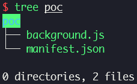
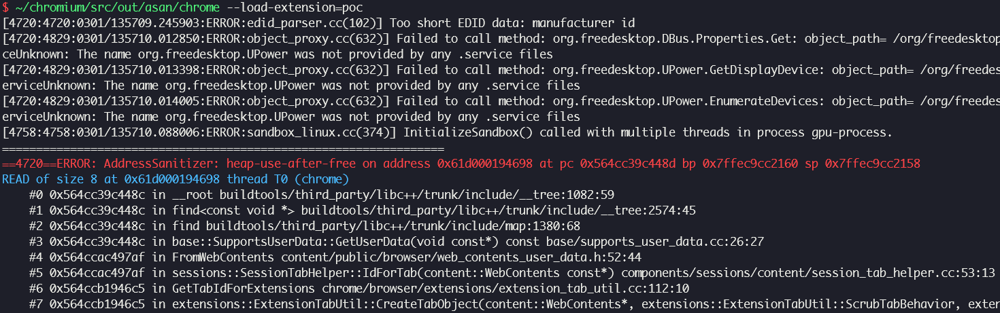

# CVE-2020-6509 (Use After Free in Extensions)

In this post, I will analyze CVE-2020-6509, use after free bug in extensions. Using this bug, we can escape Chromium sandbox and crash browser process.

## Setup

- Ubuntu 20.04.6 LTS (WSL)
- [83.0.4103.114](https://chromium.googlesource.com/chromium/src.git/+/refs/tags/83.0.4103.114) (Jun 18, 2020)

Run [`setup.zsh`](./setup.zsh) in your working directory.

## Analysis

### Tab strip

Tab strip is a collection of tabs which users can select.

Tab strip is represented by [`TabStripModel`](https://source.chromium.org/chromium/chromium/src/+/63d7de5b033e5bed0f9c1331040480a8ec920b85:chrome/browser/ui/tabs/tab_strip_model.h;l=78) class, and each tab in tab strip is represented by [`WebContentsData`](https://source.chromium.org/chromium/chromium/src/+/63d7de5b033e5bed0f9c1331040480a8ec920b85:chrome/browser/ui/tabs/tab_strip_model.cc;l=171) class. `TabStripModel` has [`contents_data_`](https://source.chromium.org/chromium/chromium/src/+/63d7de5b033e5bed0f9c1331040480a8ec920b85:chrome/browser/ui/tabs/tab_strip_model.h;l=751) which is a vector consisted of `WebContentsData`s.

We can control (add, remove, etc.) the tabs in tab strip using [`chrome.tabs`](https://developer.chrome.com/docs/extensions/mv2/reference/tabs) API available in Chrome extension.

### Root cause

[`TabStripModel::FixOpeners()`](https://source.chromium.org/chromium/chromium/src/+/63d7de5b033e5bed0f9c1331040480a8ec920b85:chrome/browser/ui/tabs/tab_strip_model.cc;l=2161) is called when a tab is moved or removed. It finds any tab whose opener is `old_contents` iterating `contents_data_` and replace its opener with opener of `old_contents`. This is similar with removing an element from single linked list.

If we can set openers of two tabs to each other, one among them is set to opener of itself after another is removed. Then, this tab can still be opener of another tab after it is removed and UAF occurs.

### Proof of concept

[`TabsGetFunction::Run()`](https://source.chromium.org/chromium/chromium/src/+/63d7de5b033e5bed0f9c1331040480a8ec920b85:chrome/browser/extensions/api/tabs/tabs_api.cc;l=1114) which handles `chrome.tabs.get()` API function, internally calls [`CreateTabObjectHelper()`](https://source.chromium.org/chromium/chromium/src/+/63d7de5b033e5bed0f9c1331040480a8ec920b85:chrome/browser/extensions/api/tabs/tabs_api.cc;l=272) → [`ExtensionTabUtil::CreateTabObject()`](https://source.chromium.org/chromium/chromium/src/+/63d7de5b033e5bed0f9c1331040480a8ec920b85:chrome/browser/extensions/extension_tab_util.cc;l=398), and tries to get tab id of freed [`opener`](https://source.chromium.org/chromium/chromium/src/+/63d7de5b033e5bed0f9c1331040480a8ec920b85:chrome/browser/extensions/extension_tab_util.cc;l=464) by calling [`GetTabIdForExtensions()`](https://source.chromium.org/chromium/chromium/src/+/63d7de5b033e5bed0f9c1331040480a8ec920b85:chrome/browser/extensions/extension_tab_util.cc;l=108).

[`manifest.json`](./poc/manifest.json) [`background.js`](./poc/background.js)

### Patch

> [TabStripModel: Fix UAF by preventing openers with dangling reference.](https://chromium.googlesource.com/chromium/src.git/+/d9fb8cd7e3bbbd03968505cfdb0ef26f40d33cc6) (Jun 10, 2020)
>
> TabStripModel::FixOpeners(index) is called to ensure that no WebContentsData has its opener set to the WebContents at the given |index|. It does this by setting the opener of any tabs that reference the tab at |index| to that tab's opener. However this can cause a tab to be its own opener (example consider two tabs which are the openers for each other).
>
> If such a tab (a tab which is its own opener) is removed, the same FixOpeners logic would cause the opener of any tabs referencing it to point to a dangling pointer. This can lead to use-after-free errors.
>
> Fix this by ensuring that a tab can't be its own opener. Also add some DCHECKs checking the same.

## References

- [Stable Channel Update for Desktop (Monday, June 22, 2020) - Chrome Releases](https://chromereleases.googleblog.com/2020/06/stable-channel-update-for-desktop_22.html)
- [uaf in extensions - Chromium Issues](https://issues.chromium.org/issues/40052517)
