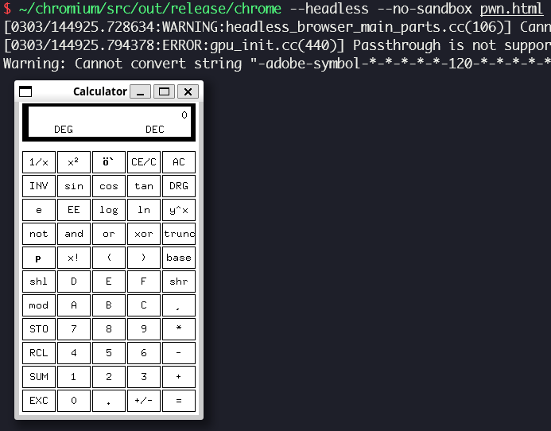

# CVE-2021-30551 (Type Confusion in V8)

In this post, I will analyze and exploit CVE-2021-30551, in-the-wild type confusion in V8. This bug can be exploited to get RCE in renderer process.

## Setup

- Ubuntu 20.04.6 LTS (WSL)
- [91.0.4472.100](https://chromium.googlesource.com/chromium/src.git/+/refs/tags/91.0.4472.100) (Jun 08, 2021)

Place [`dcheck.diff`](./dcheck.diff) and [`setup.zsh`](./setup.zsh) in your working directory and run `setup.zsh`.

## Analysis

### Property interceptor

When we try to get or set a property of an object in which property interceptor is implemented, it runs predefined custom action instead of accessing to the property generally. For example, [`<object>`](https://developer.mozilla.org/docs/Web/HTML/Element/object) and [`<embed>`](https://developer.mozilla.org/docs/Web/HTML/Element/embed) elements in HTML have property interceptors, and they are implemented as following functions:

- [`V8HTMLEmbedElement::NamedPropertyGetterCustom()`](https://source.chromium.org/chromium/chromium/src/+/refs/tags/91.0.4472.100:third_party/blink/renderer/bindings/core/v8/custom/v8_html_plugin_element_custom.cc;l=130)
- [`V8HTMLObjectElement::NamedPropertyGetterCustom()`](https://source.chromium.org/chromium/chromium/src/+/refs/tags/91.0.4472.100:third_party/blink/renderer/bindings/core/v8/custom/v8_html_plugin_element_custom.cc;l=138)
- [`V8HTMLEmbedElement::NamedPropertySetterCustom()`](https://source.chromium.org/chromium/chromium/src/+/refs/tags/91.0.4472.100:third_party/blink/renderer/bindings/core/v8/custom/v8_html_plugin_element_custom.cc;l=146)
- [`V8HTMLObjectElement::NamedPropertySetterCustom()`](https://source.chromium.org/chromium/chromium/src/+/refs/tags/91.0.4472.100:third_party/blink/renderer/bindings/core/v8/custom/v8_html_plugin_element_custom.cc;l=155)

[`Object::SetProperty()`](https://source.chromium.org/chromium/v8/v8/+/refs/tags/9.1.269.33:src/objects/objects.cc;l=2615) is responsible for setting property. It firstly tries to set property value by calling [`Object::SetPropertyInternal()`](https://source.chromium.org/chromium/v8/v8/+/refs/tags/9.1.269.33:src/objects/objects.cc;l=2621), and it calls [`Object::AddDataProperty()`](https://source.chromium.org/chromium/v8/v8/+/refs/tags/9.1.269.33:src/objects/objects.cc;l=2643) as fallback if [`found`](https://source.chromium.org/chromium/v8/v8/+/refs/tags/9.1.269.33:src/objects/objects.cc;l=2619) is set to `false` inside of `Object::SetPropertyInternal()`.

### Proof of concept: Add two properties with the same name

[`poc.html`](./poc.html)

[`Object::SetPropertyInternal()`](https://source.chromium.org/chromium/v8/v8/+/refs/tags/9.1.269.33:src/objects/objects.cc;l=2501) searches for the property named [`it->name_`](https://source.chromium.org/chromium/v8/v8/+/refs/tags/9.1.269.33:src/objects/lookup.h;l=284) on prototype chain of [`it->receiver_`](https://source.chromium.org/chromium/v8/v8/+/refs/tags/9.1.269.33:src/objects/lookup.h;l=286). If it encounters an object which has property interceptor while iterating prototype chain, `it->state()` is set to [`LookupIterator::INTERCEPTOR`](https://source.chromium.org/chromium/v8/v8/+/refs/tags/9.1.269.33:src/objects/objects.cc;l=2536). [`LookupIterator::HolderIsReceiverOrHiddenPrototype()`](https://source.chromium.org/chromium/v8/v8/+/refs/tags/9.1.269.33:src/objects/objects.cc;l=2537) returns `false` if:

- [`*receiver_ != *holder_`](https://source.chromium.org/chromium/v8/v8/+/refs/tags/9.1.269.33:src/objects/lookup.cc;l=840): Object holding the property which is been searching for, which is `holder_`, is not identical with `receiver_`
- [`!receiver_->IsJSGlobalProxy(isolate_)`](https://source.chromium.org/chromium/v8/v8/+/refs/tags/9.1.269.33:src/objects/lookup.cc;l=841): `receiver_` is not `JSGlobalProxy` object

[`maybe_attributes.FromJust() == ABSENT`](https://source.chromium.org/chromium/v8/v8/+/refs/tags/9.1.269.33:src/objects/objects.cc;l=2548) means there is no such property on prototype chain. In this case, `Object::SetPropertyInternal()` escapes from `switch` block, sets `found` to [`false`](https://source.chromium.org/chromium/v8/v8/+/refs/tags/9.1.269.33:src/objects/objects.cc;l=2611) and returns.

We can call another `Object::SetPropertyInternal()` and let the code which handles interceptor case be executed asynchronously while `Object::AddDataProperty()` is proceeding, by defining `onload()` method of `<object>` or `<embed>` element. The second `Object::SetPropertyInternal()` follows the same code path which sets `found` to `false` and returns, thus `Object::AddDataProperty()` is called again. As a result, we can add two properties with the same name.

### Proof of concept: Overlap property using deprecated map

[`poc_overlap.html`](./poc_overlap.html)

When we add a new property to an object which is not [`JSArray`](https://source.chromium.org/chromium/v8/v8/+/refs/tags/9.1.269.33:src/objects/objects.cc;l=2869), [`Object::AddDataProperty()`](https://source.chromium.org/chromium/v8/v8/+/refs/tags/9.1.269.33:src/objects/objects.cc;l=2832) calls [`LookupIterator::PrepareTransitionToDataProperty()`](https://source.chromium.org/chromium/v8/v8/+/refs/tags/9.1.269.33:src/objects/objects.cc;l=2888) and [`LookupIterator::ApplyTransitionToDataProperty()`](https://source.chromium.org/chromium/v8/v8/+/refs/tags/9.1.269.33:src/objects/objects.cc;l=2891) to update map of the object if it is deprecated, then calls [`LookupIterator::WriteDataValue()`](https://source.chromium.org/chromium/v8/v8/+/refs/tags/9.1.269.33:src/objects/objects.cc;l=2894) to store property value.

If `receiver` is not [`JSGlobalObject`](https://source.chromium.org/chromium/v8/v8/+/refs/tags/9.1.269.33:src/objects/lookup.cc;l=606), [`LookupIterator::ApplyTransitionToDataProperty()`](https://source.chromium.org/chromium/v8/v8/+/refs/tags/9.1.269.33:src/objects/lookup.cc;l=600) gets [`transition`](https://source.chromium.org/chromium/v8/v8/+/refs/tags/9.1.269.33:src/objects/lookup.cc;l=626) which is new map of `receiver`. [`simple_transition`](https://source.chromium.org/chromium/v8/v8/+/refs/tags/9.1.269.33:src/objects/lookup.cc;l=627) is set to `true` if current map of `receiver` is back pointer of `transition`, but it's not if current map of `receiver` is deprecated, which means there already exists a transition to `transition`.

[`JSObject::MigrateToMap()`](https://source.chromium.org/chromium/v8/v8/+/refs/tags/9.1.269.33:src/objects/lookup.cc;l=640) is called if `receiver` is not [`JSProxy`](https://source.chromium.org/chromium/v8/v8/+/refs/tags/9.1.269.33:src/objects/lookup.cc;l=639). [`JSObject::MigrateToMap()`](https://source.chromium.org/chromium/v8/v8/+/refs/tags/9.1.269.33:src/objects/js-objects.cc;l=3078) calls [`MigrateFastToFast()`](https://source.chromium.org/chromium/v8/v8/+/refs/tags/9.1.269.33:src/objects/js-objects.cc;l=3093) if both of [`old_map`](https://source.chromium.org/chromium/v8/v8/+/refs/tags/9.1.269.33:src/objects/js-objects.cc;l=3085) and [`new_map`](https://source.chromium.org/chromium/v8/v8/+/refs/tags/9.1.269.33:src/objects/js-objects.cc;l=3092) are not dictionary maps, which means they don't have any slow property. [`MigrateFastToFast()`](https://source.chromium.org/chromium/v8/v8/+/refs/tags/9.1.269.33:src/objects/js-objects.cc;l=2762) copies in-object properties by calling [`JSObject::FastPropertyAtPut()`](https://source.chromium.org/chromium/v8/v8/+/refs/tags/9.1.269.33:src/objects/js-objects.cc;l=2930). For new property which is being added now, `MigrateFastToFast()` is responsible for only preparing a space for new property, not storing property value. The actual value is going to be stored in `LookupIterator::WriteDataValue()` which is called after `LookupIterator::ApplyTransitionToDataProperty()` is returned in `Object::AddDataProperty()`. Therefore, `MigrateFastToFast()` temporarily stores [`Oddball`](https://source.chromium.org/chromium/v8/v8/+/refs/tags/9.1.269.33:src/objects/oddball.h;l=19) object in the empty space for new property.

`LookupIterator::ApplyTransitionToDataProperty()` prepares to store property value after `JSObject::MigrateToMap()` is returned. If `simple_transition` is `false` and map of `receiver` is not a dictionary map, [`LookupIterator::ReloadPropertyInformation()`](https://source.chromium.org/chromium/v8/v8/+/refs/tags/9.1.269.33:src/objects/lookup.cc;l=678) → [`LookupIterator::LookupInHolder()`](https://source.chromium.org/chromium/v8/v8/+/refs/tags/9.1.269.33:src/objects/lookup.cc;l=173) → [`LookupIterator::LookupInRegularHolder()`](https://source.chromium.org/chromium/v8/v8/+/refs/tags/9.1.269.33:src/objects/lookup.h;l=232) is called. [`LookupIterator::LookupInRegularHolder()`](https://source.chromium.org/chromium/v8/v8/+/refs/tags/9.1.269.33:src/objects/lookup.cc;l=1160) gets some information which are needed to access to the property, like [`number_`](https://source.chromium.org/chromium/v8/v8/+/refs/tags/9.1.269.33:src/objects/lookup.cc;l=1185) which is in-object index of the property. [`DescriptorArray::SearchWithCache()`](https://source.chromium.org/chromium/v8/v8/+/refs/tags/9.1.269.33:src/objects/descriptor-array-inl.h;l=75) searches for `name` in descriptor array of `map` and returns its index. It goes into [`DescriptorArray::Search()`](https://source.chromium.org/chromium/v8/v8/+/refs/tags/9.1.269.33:src/objects/descriptor-array-inl.h;l=85) → [`Search()`](https://source.chromium.org/chromium/v8/v8/+/refs/tags/9.1.269.33:src/objects/descriptor-array-inl.h;l=63) → [`LinearSearch()`](https://source.chromium.org/chromium/v8/v8/+/refs/tags/9.1.269.33:src/objects/fixed-array-inl.h;l=360), and searches for `name` from the front. It gets the first among the properties with the same name, whose in-object index is 0.

Then, `Object::AddDataProperty()` calls [`LookupIterator::WriteDataValue()`](https://source.chromium.org/chromium/v8/v8/+/refs/tags/9.1.269.33:src/objects/objects.cc;l=2894) → [`JSObject::WriteToField()`](https://source.chromium.org/chromium/v8/v8/+/refs/tags/9.1.269.33:src/objects/lookup.cc;l=1016) and overlaps old property with the value of new property. As a result, the space for new property which is temporarily filled with `Oddball` remains.

### Patch

> [[runtime] Fix handling of interceptors](https://chromium.googlesource.com/v8/v8/+/f9857fdf743eeb263aec3944259ad811f564291b) (Jun 07, 2021)
>
> [[runtime] Fix handling of interceptors, pt.2](https://chromium.googlesource.com/v8/v8/+/1f5113816c514b45084e0c2f66ca06f030ae09c6) (Jun 07, 2021)
>
> [[runtime] Refactor interceptor handling](https://chromium.googlesource.com/v8/v8/+/368a20bcd75b5444aa50e387ccdbf3842ae38844) (Jun 09, 2021)

## Exploitation

### Type confusion by reducing CheckMaps

When Turbofan compiles a function, [`JSNativeContextSpecialization::ReduceJSLoadNamed()`](https://source.chromium.org/chromium/v8/v8/+/refs/tags/9.1.269.33:src/compiler/js-native-context-specialization.cc;l=1467) is responsible for reducing `JSLoadNamed` node which loads property by its name. It calls [`JSNativeContextSpecialization::ReducePropertyAccess()`](https://source.chromium.org/chromium/v8/v8/+/refs/tags/9.1.269.33:src/compiler/js-native-context-specialization.cc;l=1506) → [`JSNativeContextSpecialization::ReduceNamedAccess()`](https://source.chromium.org/chromium/v8/v8/+/refs/tags/9.1.269.33:src/compiler/js-native-context-specialization.cc;l=2048) → [`JSHeapBroker::GetPropertyAccessInfo()`](https://source.chromium.org/chromium/v8/v8/+/refs/tags/9.1.269.33:src/compiler/js-native-context-specialization.cc;l=1206) to get property access info, which might be helpful for optimizing property access. [`JSHeapBroker::GetPropertyAccessInfo()`](https://source.chromium.org/chromium/v8/v8/+/refs/tags/9.1.269.33:src/compiler/js-heap-broker.cc;l=5536) gets `access_info` by calling [`AccessInfoFactory::ComputePropertyAccessInfo()`](https://source.chromium.org/chromium/v8/v8/+/refs/tags/9.1.269.33:src/compiler/js-heap-broker.cc;l=5552), which calls [`AccessInfoFactory::ComputeDataFieldAccessInfo()`](https://source.chromium.org/chromium/v8/v8/+/refs/tags/9.1.269.33:src/compiler/access-info.cc;l=788) for in-object property containing normal data. [`AccessInfoFactory::ComputeDataFieldAccessInfo()`](https://source.chromium.org/chromium/v8/v8/+/refs/tags/9.1.269.33:src/compiler/access-info.cc;l=426) gets [`descriptors_field_type`](https://source.chromium.org/chromium/v8/v8/+/refs/tags/9.1.269.33:src/compiler/access-info.cc;l=463) from `descriptor` for the property, if the property contains a [`HeapObject`](https://source.chromium.org/chromium/v8/v8/+/refs/tags/9.1.269.33:src/compiler/access-info.cc;l=460).

If the object which the property contains has at least one property, and the map of the object is the only map which the property globally has, a weak reference of the map is stored in [value](https://source.chromium.org/chromium/v8/v8/+/refs/tags/9.1.269.33:src/objects/descriptor-array.h;l=52) field of descriptor as field type. This information is used when Turbofan tries to reduce `CheckMaps` node in `LoadElimination` phase. In [`LoadElimination::ReduceCheckMaps()`](https://source.chromium.org/chromium/v8/v8/+/refs/tags/9.1.269.33:src/compiler/load-elimination.cc;l=752), which is responsible for optimizing `CheckMaps` node, [`maps`](https://source.chromium.org/chromium/v8/v8/+/refs/tags/9.1.269.33:src/compiler/load-elimination.cc;l=753) contains the maps from property access info, and [`object_maps`](https://source.chromium.org/chromium/v8/v8/+/refs/tags/9.1.269.33:src/compiler/load-elimination.cc;l=758) contains the maps which `object` can have. If `maps.contains(object_maps)` returns `true`, it means `object_maps` is covered by `maps`, in other words, it means there is no possibility of encountering unexpected map, so `CheckMaps` is not needed and removed by [`AdvancedReducer::Replace()`](https://source.chromium.org/chromium/v8/v8/+/refs/tags/9.1.269.33:src/compiler/load-elimination.cc;l=760).

### OOB read/write

We can access to `oob_arr` which is basically an object, in the same way we access to `arr`, by triggering type confusion between them. [`read()`](./pwn.html#L62) and [`write()`](./pwn.html#L65) is optimized based on map of `o1.corrupted` which is `arr`, so we can access out of bounds of `o2.corrupted`, which is `oob_arr`. We can implement some exploitation primitives like [`addrof()`](./pwn.html#L74) and [AAR](./pwn.html#L80)/[AAW](./pwn.html#L87) using this OOB.

### Escape V8 sandbox to get RCE

> [Escaping V8 Sandbox via ArrayBuffer and WebAssembly Jump Table (Chromium < 100.0.4896.60)](https://aaronsjcho.github.io/Escaping-V8-Sandbox-via-ArrayBuffer-and-WebAssembly-Jump-Table/)

[`pwn.wat`](./pwn.wat) [`wasm.py`](./wasm.py) [`shellcode.py`](./shellcode.py)

You have to install `/bin/xcalc` via `sudo apt install -y x11-apps` before running [`pwn.html`](./pwn.html).

## References

- [Stable Channel Update for Desktop (Wednesday, June 9, 2021) - Chrome Releases](https://chromereleases.googleblog.com/2021/06/stable-channel-update-for-desktop.html)
- [Security: Unexpected JS execution in GetScriptableObjectProperty leads to JS object corruption - Chromium Issues](https://issues.chromium.org/issues/40056119)
- [CVE-2021-30551: Chrome Type Confusion in V8 - 0-days In-the-Wild](https://googleprojectzero.github.io/0days-in-the-wild/0day-RCAs/2021/CVE-2021-30551.html)
