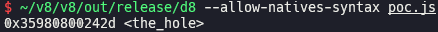
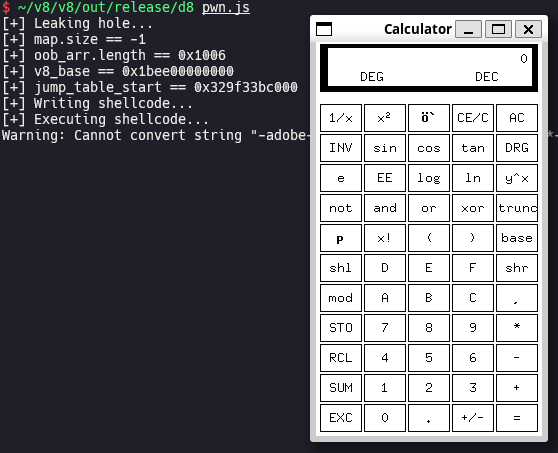

# CVE-2021-38003 (Inappropriate Implementation in V8)

In this post, I will analyze and exploit CVE-2021-38003, in-the-wild bug in V8. Using this bug, we can leak `hole` object and exploit it to get RCE.

## Setup

- Ubuntu 20.04.6 LTS (WSL)
- [a4252db3228433fed5c2bdb0fdff9a6b7b638f3b](https://chromium.googlesource.com/v8/v8/+/a4252db3228433fed5c2bdb0fdff9a6b7b638f3b) (Oct 26th, 2021)

Run [`setup.zsh`](./setup.zsh) in you working directory.

## Analysis

### Root cause

[`JSON.stringify()`](https://developer.mozilla.org/docs/Web/JavaScript/Reference/Global_Objects/JSON/stringify) converts JavaScript object to string, and it is handled by [`BUILTIN(JsonStringify)`](https://source.chromium.org/chromium/v8/v8/+/a4252db3228433fed5c2bdb0fdff9a6b7b638f3b:src/builtins/builtins-json.cc;l=31), which calls [`JsonStringify()`](https://source.chromium.org/chromium/v8/v8/+/a4252db3228433fed5c2bdb0fdff9a6b7b638f3b:src/json/json-stringifier.cc;l=141) and pass the return value to [`RETURN_RESULT_OR_FAILURE()`](https://source.chromium.org/chromium/v8/v8/+/a4252db3228433fed5c2bdb0fdff9a6b7b638f3b:src/execution/isolate.h;l=210). `JsonStringify()` internally calls [`JsonStringifier::Stringify()`](https://source.chromium.org/chromium/v8/v8/+/a4252db3228433fed5c2bdb0fdff9a6b7b638f3b:src/json/json-stringifier.cc;l=224) → [`JsonStringifier::SerializeObject()`](https://source.chromium.org/chromium/v8/v8/+/a4252db3228433fed5c2bdb0fdff9a6b7b638f3b:src/json/json-stringifier.cc;l=45) → [`JsonStringifier::Serialize_()`](https://source.chromium.org/chromium/v8/v8/+/a4252db3228433fed5c2bdb0fdff9a6b7b638f3b:src/json/json-stringifier.cc;l=516).

Type of return value of `JsonStringifier::SerializeObject()` is [`JsonStringifier::Result`](https://source.chromium.org/chromium/v8/v8/+/a4252db3228433fed5c2bdb0fdff9a6b7b638f3b:src/json/json-stringifier.cc;l=34). `JsonStringifier::Stringify()` [returns `Handle` for `nullptr`](https://source.chromium.org/chromium/v8/v8/+/a4252db3228433fed5c2bdb0fdff9a6b7b638f3b:src/json/json-stringifier.cc;l=235) if `JsonStringifier::SerializeObject()` returns `EXCEPTION`, then `nullptr` is passed to the second argument (`call`) of `RETURN_RESULT_OR_FAILURE()`. `RETURN_RESULT_OR_FAILURE()` tries to store `Handle` of passed `call` in [`__result__`](https://source.chromium.org/chromium/v8/v8/+/a4252db3228433fed5c2bdb0fdff9a6b7b638f3b:src/execution/isolate.h;l=214) by calling [`ToHandle()`](https://source.chromium.org/chromium/v8/v8/+/a4252db3228433fed5c2bdb0fdff9a6b7b638f3b:src/handles/maybe-handles.h;l=60), which returns `false` if receiver ([`location_`](https://source.chromium.org/chromium/v8/v8/+/a4252db3228433fed5c2bdb0fdff9a6b7b638f3b:src/handles/maybe-handles.h;l=79)) is `nullptr` and returns `true` otherwise. `RETURN_RESULT_OR_FAILURE()` returns [`pending_exception_`](https://source.chromium.org/chromium/v8/v8/+/a4252db3228433fed5c2bdb0fdff9a6b7b638f3b:src/execution/thread-local-top.h;l=112) if return value of `ToHandle()` is `false`. 

We can find total of 11 `return EXCEPTION;` statements in `json-stringifier.cc` ([1](https://source.chromium.org/chromium/v8/v8/+/a4252db3228433fed5c2bdb0fdff9a6b7b638f3b:src/json/json-stringifier.cc;l=381), [2](https://source.chromium.org/chromium/v8/v8/+/a4252db3228433fed5c2bdb0fdff9a6b7b638f3b:src/json/json-stringifier.cc;l=394), [3](https://source.chromium.org/chromium/v8/v8/+/a4252db3228433fed5c2bdb0fdff9a6b7b638f3b:src/json/json-stringifier.cc;l=523), [4](https://source.chromium.org/chromium/v8/v8/+/a4252db3228433fed5c2bdb0fdff9a6b7b638f3b:src/json/json-stringifier.cc;l=547), [5](https://source.chromium.org/chromium/v8/v8/+/a4252db3228433fed5c2bdb0fdff9a6b7b638f3b:src/json/json-stringifier.cc;l=611), [6](https://source.chromium.org/chromium/v8/v8/+/a4252db3228433fed5c2bdb0fdff9a6b7b638f3b:src/json/json-stringifier.cc;l=662), [7](https://source.chromium.org/chromium/v8/v8/+/a4252db3228433fed5c2bdb0fdff9a6b7b638f3b:src/json/json-stringifier.cc;l=680), [8](https://source.chromium.org/chromium/v8/v8/+/a4252db3228433fed5c2bdb0fdff9a6b7b638f3b:src/json/json-stringifier.cc;l=735), [9](https://source.chromium.org/chromium/v8/v8/+/a4252db3228433fed5c2bdb0fdff9a6b7b638f3b:src/json/json-stringifier.cc;l=747), [10](https://source.chromium.org/chromium/v8/v8/+/a4252db3228433fed5c2bdb0fdff9a6b7b638f3b:src/json/json-stringifier.cc;l=848), [11](https://source.chromium.org/chromium/v8/v8/+/a4252db3228433fed5c2bdb0fdff9a6b7b638f3b:src/json/json-stringifier.cc;l=862)). Most of them have a line of code which internally sets `pending_exception_` like [`isolate_->Throw()`](https://source.chromium.org/chromium/v8/v8/+/a4252db3228433fed5c2bdb0fdff9a6b7b638f3b:src/execution/isolate.h;l=896), [`isolate_->StackOverflow()`](https://source.chromium.org/chromium/v8/v8/+/a4252db3228433fed5c2bdb0fdff9a6b7b638f3b:src/execution/isolate.cc;l=1405) or [`isolate_->stack_guard()->HandleInterrupts()`](https://source.chromium.org/chromium/v8/v8/+/a4252db3228433fed5c2bdb0fdff9a6b7b638f3b:src/execution/stack-guard.cc;l=264) right before them. The first one calls [`Isolate::ThrowInternal()`](https://source.chromium.org/chromium/v8/v8/+/a4252db3228433fed5c2bdb0fdff9a6b7b638f3b:src/execution/isolate.cc;l=1609) which [calls `set_pending_exception()`](https://source.chromium.org/chromium/v8/v8/+/a4252db3228433fed5c2bdb0fdff9a6b7b638f3b:src/execution/isolate.cc;l=1694), the second one calls `Isolate::Throw()`, and the third one calls [`Isolate::TerminateExecution()`](https://source.chromium.org/chromium/v8/v8/+/a4252db3228433fed5c2bdb0fdff9a6b7b638f3b:src/execution/isolate.cc;l=1477) which calls `Isolate::Throw()`. However, there are two exceptions ([9](https://source.chromium.org/chromium/v8/v8/+/a4252db3228433fed5c2bdb0fdff9a6b7b638f3b:src/json/json-stringifier.cc;l=747), [10](https://source.chromium.org/chromium/v8/v8/+/a4252db3228433fed5c2bdb0fdff9a6b7b638f3b:src/json/json-stringifier.cc;l=848)) which don't set `pending_exception_` before `EXCEPTION` is returned.

The first exception is in [`JsonStringifier::SerializeArrayLikeSlow()`](https://source.chromium.org/chromium/v8/v8/+/a4252db3228433fed5c2bdb0fdff9a6b7b638f3b:src/json/json-stringifier.cc;l=729) which is called while serializing an array. It calls [`JsonStringifier::SerializeElement()`](https://source.chromium.org/chromium/v8/v8/+/a4252db3228433fed5c2bdb0fdff9a6b7b638f3b:src/json/json-stringifier.cc;l=51) for each element, and returns `EXCEPTION` if `JsonStringifier::SerializeElement()` returns `UNCHANGED` and [`builder_.HasOverflowed()`](https://source.chromium.org/chromium/v8/v8/+/a4252db3228433fed5c2bdb0fdff9a6b7b638f3b:src/strings/string-builder-inl.h;l=178) returns `true`. [`IncrementalStringBuilder::overflowed_`](https://source.chromium.org/chromium/v8/v8/+/a4252db3228433fed5c2bdb0fdff9a6b7b638f3b:src/strings/string-builder-inl.h;l=297) is [set to `true`](https://source.chromium.org/chromium/v8/v8/+/a4252db3228433fed5c2bdb0fdff9a6b7b638f3b:src/strings/string-builder.cc;l=254) in [`IncrementalStringBuilder::Accumulate()`](https://source.chromium.org/chromium/v8/v8/+/a4252db3228433fed5c2bdb0fdff9a6b7b638f3b:src/strings/string-builder.cc;l=249) if length of accumulated string exceeds [`String::kMaxLength`](https://source.chromium.org/chromium/v8/v8/+/a4252db3228433fed5c2bdb0fdff9a6b7b638f3b:src/objects/string.h;l=452). If we try to stringify a very big array which lets length of the result of `JSON.stringify()` longer than `String::kMaxLength`, it throws an error and we can get `hole` object from error object.

The second exception is in [`JsonStringifier::SerializeJSProxy()`](https://source.chromium.org/chromium/v8/v8/+/a4252db3228433fed5c2bdb0fdff9a6b7b638f3b:src/json/json-stringifier.cc;l=842) which is called while serializing a `Proxy` object. `JsonStringifier::SerializeJSProxy()` returns `EXCEPTION` if [`Object::IsArray()`](https://source.chromium.org/chromium/v8/v8/+/a4252db3228433fed5c2bdb0fdff9a6b7b638f3b:src/objects/objects-inl.h;l=399) returns `Nothing<bool>()`, but [`JSProxy::IsArray()`](https://source.chromium.org/chromium/v8/v8/+/a4252db3228433fed5c2bdb0fdff9a6b7b638f3b:src/objects/objects.cc;l=2971) calls `isolate->Throw()` or `isolate->StackOverflow()` to set `pending_exception_` before it returns `Nothing<bool>()`, so there is no bug here.

### Proof of concept

[`poc.js`](./poc.js) might take a long time in debug build.

### Patch

> [[runtime] Check if we have a pending exception before returning it](https://chromium.googlesource.com/v8/v8/+/be55c16e50e714475034b00ed2682f0813794d15) (Oct 26th, 2021)

## Exploitation

> [Exploiting V8 Hole via Corrupting Map Object (Chromium < 103.0.5060.53)](https://aaronsjcho.github.io/Exploiting-V8-Hole-via-Corrupting-Map-Object/)
>
> [Escaping V8 Sandbox via ArrayBuffer and WebAssembly Jump Table (Chromium < 100.0.4896.60)](https://aaronsjcho.github.io/Escaping-V8-Sandbox-via-ArrayBuffer-and-WebAssembly-Jump-Table/)

[`pwn.wat`](./pwn.wat) [`wasm.py`](./wasm.py) [`shellcode.py`](./shellcode.py)

You have to install `/bin/xcalc` via `sudo apt install -y x11-apps` before running [`pwn.js`](./pwn.js) if you are using WSL.

## References

- [Stable Channel Update for Desktop (Thursday, October 28, 2021) - Chrome Releases](https://chromereleases.googleblog.com/2021/10/stable-channel-update-for-desktop_28.html)
- [Security: JSON.stringify leaks TheHole value, leading to RCE - Chromium Issues](https://issues.chromium.org/issues/40057710)
- [TheHole New World - how a small leak will sink a great browser (CVE-2021-38003) - Star Labs](https://starlabs.sg/blog/2022/12-the-hole-new-world-how-a-small-leak-will-sink-a-great-browser-cve-2021-38003/)
