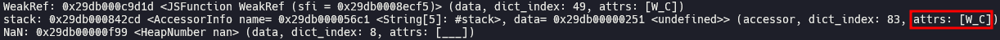

# CVE-2023-2033 (Type Confusion in V8)

In this post, I will analyze and exploit CVE-2023-2033, an in-the-wild type confusion bug in V8. Using this bug, we can leak `hole` object and exploit it to get RCE.

## Setup

- Ubuntu 22.04.5 LTS (WSL)
- [f7a3499f6d7e50b227a17d2bbd96e4b59a261d3c](https://chromium.googlesource.com/v8/v8/+/f7a3499f6d7e50b227a17d2bbd96e4b59a261d3c) (Apr 12th, 2023)

Run [`setup.zsh`](./setup.zsh) in your working directory.

## Analysis

### Stack trace API

```js
// flags: --allow-natives-syntax --shell

function f() {
    return new Error();
}

function g() {
    return f();
}

let o = g();
% DebugPrint(o);
```

When a new [`Error`](https://developer.mozilla.org/en-US/docs/Web/JavaScript/Reference/Global_Objects/Error) object is generated, it basically has two properties, `error_stack_symbol` which contains captured stack trace, and its accessor `stack`.


`error_stack_symbol` is an array consisted of `CallSiteInfo`s, while each `CallSiteInfo` represents a stack frame in stack trace.


The maximum size of `error_stack_symbol` is controlled by run-time option `--stack-trace-limit` (default: 10).


When we access to accessor `stack` for the first time, all `CallSiteInfo`s are collected and reconstructed as a string.


The stack tracing mechanism shown above is implemented using stack trace API which is also available to user scripts.

```js
// flags: --allow-natives-syntax --shell

function f() {
    let o = new Object();
    Error.captureStackTrace(o);
    return o;
}

function g() {
    return f();
}

let o = g();
% DebugPrint(o);
```

With [`Error.captureStackTrace()`](https://developer.mozilla.org/en-US/docs/Web/JavaScript/Reference/Global_Objects/Error#error.capturestacktrace), we can capture stack trace and save it to arbitrary object.


Redefining [`Error.prepareStackTrace()`](https://developer.mozilla.org/en-US/docs/Web/JavaScript/Reference/Global_Objects/Error#error.preparestacktrace), we can customize the way that stack trace is returned to user. When we access to accessor `stack` for the first time, `Error.prepareStackTrace()` is called and its return value is saved to `error_stack_symbol`.


### Global property access optimization

Global property means property of [`JSGlobalObject`](https://source.chromium.org/chromium/v8/v8/+/f7a3499f6d7e50b227a17d2bbd96e4b59a261d3c:src/objects/js-objects.h;l=1079). We can add a global property by defining a variable using `var` keyword, or adding a property to [`globalThis`](https://developer.mozilla.org/en-US/docs/Web/JavaScript/Reference/Global_Objects/globalThis) object, which represents [`JSGlobalProxy`](https://source.chromium.org/chromium/v8/v8/+/f7a3499f6d7e50b227a17d2bbd96e4b59a261d3c:src/objects/js-objects.h;l=1063), a [`Proxy`](https://developer.mozilla.org/en-US/docs/Web/JavaScript/Reference/Global_Objects/Proxy) object for `JSGlobalObject`. In JavaScript, we can't directly access to `JSGlobalObject`, but can access via `JSGlobalProxy`.


Properties of `JSGlobalObject` are managed by [`GlobalDictionary`](https://source.chromium.org/chromium/v8/v8/+/f7a3499f6d7e50b227a17d2bbd96e4b59a261d3c:src/objects/dictionary.h;l=274), as a form of [`PropertyCell`](https://source.chromium.org/chromium/v8/v8/+/f7a3499f6d7e50b227a17d2bbd96e4b59a261d3c:src/objects/property-cell.h;l=18). 


When Turbofan compiles a function, global property access is handled by [`JSNativeContextSpecialization::ReduceGlobalAccess()`](https://source.chromium.org/chromium/v8/v8/+/f7a3499f6d7e50b227a17d2bbd96e4b59a261d3c:src/compiler/js-native-context-specialization.cc;l=1081).

[When `access_mode` is `AccessMode::kLoad`](https://source.chromium.org/chromium/v8/v8/+/f7a3499f6d7e50b227a17d2bbd96e4b59a261d3c:src/compiler/js-native-context-specialization.cc;l=1153), which means that the function is trying to read global property, the address of property cell is [optimized to a constant](https://source.chromium.org/chromium/v8/v8/+/f7a3499f6d7e50b227a17d2bbd96e4b59a261d3c:src/compiler/js-native-context-specialization.cc;l=1209) if following conditions are satisfied:

1. [`!property_details.IsConfigurable() && property_details.IsReadOnly()`](https://source.chromium.org/chromium/v8/v8/+/f7a3499f6d7e50b227a17d2bbd96e4b59a261d3c:src/compiler/js-native-context-specialization.cc;l=1156) is `false`
2. [`property_details.cell_type() == PropertyCellType::kConstant || property_details.cell_type() == PropertyCellType::kUndefined`](https://source.chromium.org/chromium/v8/v8/+/f7a3499f6d7e50b227a17d2bbd96e4b59a261d3c:src/compiler/js-native-context-specialization.cc;l=1170) is `false`

```js
// flags: --allow-natives-syntax --shell

globalThis.gvar = 1; // PropertyCellType::kConstant
gvar = 2; // PropertyCellType::kConstantType

function f() {
    return gvar; // AccessMode::kLoad
}

for (let i = 0; i < 0x10000; i++) { f(); } // compile via turbofan
% DebugPrint(f);
```


We can see that the code of `f()` is optimized to read `gvar` from the constant property cell (red box).

On the other hand, we also can see the code for lazy deoptimization (blue box). At this point, `rbx` has the address of [`Code`](https://source.chromium.org/chromium/v8/v8/+/f7a3499f6d7e50b227a17d2bbd96e4b59a261d3c:src/objects/code.h;l=50) object, and there are [`FLAGS_BIT_FIELDS`](https://source.chromium.org/chromium/v8/v8/+/f7a3499f6d7e50b227a17d2bbd96e4b59a261d3c:src/objects/code.h;l=345) in `rbx+0x17`.


The optimized code checks if 29th bit of `FLAGS_BIT_FIELDS` is on, which means [`MarkedForDeoptimizationField`](https://source.chromium.org/chromium/v8/v8/+/f7a3499f6d7e50b227a17d2bbd96e4b59a261d3c:src/objects/code.h;l=350) is set to `true`. If so, it calls `Builtins_CompileLazyDeoptimizedCode()` to deoptimize the function.

### Code dependency and deoptimization

When Turbofan compiles a function, it installs code dependency to the optimized code. Code dependency means some prerequisites that should be met for normal operation of the optimized code. If code dependency is broken, deoptimization should be proceeded.

[`DependentCode`](https://source.chromium.org/chromium/v8/v8/+/f7a3499f6d7e50b227a17d2bbd96e4b59a261d3c:src/objects/dependent-code.h;l=27) is a list consisted of tuples of `Code` object and [`DependencyGroup`](https://source.chromium.org/chromium/v8/v8/+/f7a3499f6d7e50b227a17d2bbd96e4b59a261d3c:src/objects/dependent-code.h;l=31). If a `Code` object is in certain `DependencyGroup`, it means that the code should be deoptimized if the code dependency for that `DependencyGroup` is broken.

```js
// flags: --allow-natives-syntax --shell --trace-opt --trace-deopt

globalThis.gvar = 1; // PropertyCellType::kConstant
gvar = 2; // PropertyCellType::kConstantType

function f() {
    return gvar; // AccessMode::kLoad
}

for (let i = 0; i < 0x10000; i++) { f(); } // compile via turbofan
% DebugPrint(f);

delete gvar;
```

When `delete gvar` is executed, `the_hole` goes into the property cell of `gvar`. The optimized code of `f()` shouldn't work after deleting `gvar`, because `f()` was optimized to read `gvar` from the constant property cell, which now contains `the_hole`.


`Code` objects in [`kPropertyCellChangedGroup`](https://source.chromium.org/chromium/v8/v8/+/f7a3499f6d7e50b227a17d2bbd96e4b59a261d3c:src/objects/dependent-code.h;l=47) depend on global property values in property cells not being changed, but this dependency is broken because we deleted `gvar`.


After calling [`code.SetMarkedForDeoptimization()`](https://source.chromium.org/chromium/v8/v8/+/f7a3499f6d7e50b227a17d2bbd96e4b59a261d3c:src/objects/code.cc;l=368), `MarkedForDeoptimizationField` of `code` is set to `true`, so `f()` will be deoptimized on next call.


### Root cause

```js
let o = {};

Error.prepareStackTrace = () => {
    Object.defineProperty(o, "stack", { value: 1 });
    console.log(o.stack);
}

Error.captureStackTrace(o);
Object.defineProperty(o, "stack", { value: 2 });
console.log(o.stack);
```


If we try to modify the value of `stack` right after calling `Error.captureStackTrace()`, we can see that the value is set to 2 after `Error.prepareStackTrace()` is completely finished.

Applying this, we can write following code:

```js
Error.prepareStackTrace = () => {
    Object.defineProperty(globalThis, "stack", { configurable: false });
    % DebugPrint(globalThis);
    % SystemBreak();
}

Error.captureStackTrace(globalThis);
Object.defineProperty(globalThis, "stack", { value: 1, configurable: true });
```

When we try to set `configurable` descriptor of `stack` to `true` using `Object.defineProperty()` right after calling `Error.captureStackTrace()`, `Error.prepareStackTrace()` is called first because it is the first access to `stack`.


In `Error.prepareStackTrace()`, `configurable` descriptor of `stack` is set to `false`.



However, it is set to `true` again, following the original purpose of `Object.defineProperty()`. This is definitely not normal but a bug.

### Proof of concept

We set `configurable` descriptor of global property `stack` from `false` to `true` using the bug. We optimize a function which reads the value of `stack` while `configurable` is `false`, which allows us to avoid installing code dependency for `kPropertyCellChangedGroup`. After that, we set `configurable` to `true` and delete `stack`. Then, `the_hole` will go into the property cell of `stack`, but the function will not be deoptimized because there is no code dependency. In conclusion, we can leak `the_hole` from the property cell of `stack`.

[`poc.js`](./poc.js)


### Patch

> [[runtime] Make Error.captureStackTrace() a no-op for global object](https://chromium.googlesource.com/v8/v8/+/fa81078cca6964def7a3833704e0dba7b05065d8) (Apr 12th, 2023)

## Exploitation

> [Exploiting V8 Hole via Number Constructor (Chromium < 115.0.5790.98)](https://aaronsjcho.github.io/Exploiting-V8-Hole-via-Number-Constructor/)

You have to install `/bin/xcalc` by running `sudo apt install -y x11-apps` before executing [`pwn.js`](./pwn.js) if you are using WSL.


## References

- [Stable Channel Update for Desktop (Friday, April 14, 2023) - Chrome Releases](https://chromereleases.googleblog.com/2023/04/stable-channel-update-for-desktop_14.html)
- [Security: [0-day] JIT optimisation issue - Chromium Issues](https://issues.chromium.org/issues/40063989)
- [mistymntncop/CVE-2023-2033 - Github](https://github.com/mistymntncop/CVE-2023-2033/blob/main/exploit.js)
- [Stack trace API - V8 Docs](https://v8.dev/docs/stack-trace-api)
