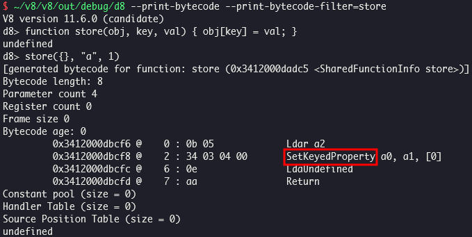
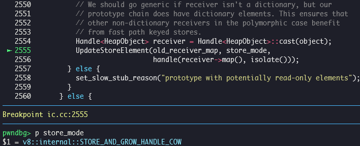

# CVE-2023-3079 (Type Confusion in V8)

In this post, I will analyze CVE-2023-3079, in-the-wild type confusion bug in V8. We can leak `hole` object by triggering the bug.

## Setup

- Ubuntu 22.04.5 LTS (WSL)
- [4217c51611830d98d7fd7b8c922571942a87ad2e](https://chromium.googlesource.com/v8/v8/+/4217c51611830d98d7fd7b8c922571942a87ad2e) (Jun 02, 2023)

Run [`setup.zsh`](./setup.zsh) in your working directory.

## Analysis

### KeyedStoreIC

Inline cache (IC) is an optimization technique which speeds up property access. It is implemented as [`IC`](https://source.chromium.org/chromium/v8/v8/+/4217c51611830d98d7fd7b8c922571942a87ad2e:src/ic/ic.h;l=27) class, which is inherited by [`LoadIC`](https://source.chromium.org/chromium/v8/v8/+/4217c51611830d98d7fd7b8c922571942a87ad2e:src/ic/ic.h;l=179) and [`StoreIC`](https://source.chromium.org/chromium/v8/v8/+/4217c51611830d98d7fd7b8c922571942a87ad2e:src/ic/ic.h;l=255).

The idea of IC is caching maps and handlers for them in the code of a function which performs property access, if the function is called repeatedly. Then, the function can access to the memory without analyzing the same map again on next time the function encounters an object whose map is already cached in the code.

Bytecode responsible for storing property is `SetKeyedProperty`, handled by `Builtins_SetKeyedPropertyHandler()` generated by [`IGNITION_HANDLER(SetKeyedProperty, InterpreterAssembler)`](https://source.chromium.org/chromium/v8/v8/+/4217c51611830d98d7fd7b8c922571942a87ad2e:src/interpreter/interpreter-generator.cc;l=646). `Builtins_SetKeyedPropertyHandler()` internally calls [`Builtins_KeyedStoreIC()`](https://source.chromium.org/chromium/v8/v8/+/4217c51611830d98d7fd7b8c922571942a87ad2e:src/interpreter/interpreter-generator.cc;l=659) generated by [`Builtins::Generate_KeyedStoreIC()`](https://source.chromium.org/chromium/v8/v8/+/4217c51611830d98d7fd7b8c922571942a87ad2e:src/builtins/builtins-ic-gen.cc;l=136) → [`AccessorAssembler::GenerateKeyedStoreIC()`](https://source.chromium.org/chromium/v8/v8/+/4217c51611830d98d7fd7b8c922571942a87ad2e:src/builtins/builtins-ic-gen.cc;l=138) → [`AccessorAssembler::KeyedStoreIC()`](https://source.chromium.org/chromium/v8/v8/+/4217c51611830d98d7fd7b8c922571942a87ad2e:src/ic/accessor-assembler.cc;l=4859).

If the code encounters a map which is not cached, cache miss occurs and [`RUNTIME_FUNCTION(Runtime_KeyedStoreIC_Miss)`](https://source.chromium.org/chromium/v8/v8/+/4217c51611830d98d7fd7b8c922571942a87ad2e:src/ic/ic.cc;l=2949) is called. It sets [`value`](https://source.chromium.org/chromium/v8/v8/+/4217c51611830d98d7fd7b8c922571942a87ad2e:src/ic/ic.cc;l=2953) of property named [`key`](https://source.chromium.org/chromium/v8/v8/+/4217c51611830d98d7fd7b8c922571942a87ad2e:src/ic/ic.cc;l=2957) of [`receiver`](https://source.chromium.org/chromium/v8/v8/+/4217c51611830d98d7fd7b8c922571942a87ad2e:src/ic/ic.cc;l=2956) by calling [`KeyedStoreIC::Store()`](https://source.chromium.org/chromium/v8/v8/+/4217c51611830d98d7fd7b8c922571942a87ad2e:src/ic/ic.cc;l=2981) or [`StoreInArrayLiteralIC::Store()`](https://source.chromium.org/chromium/v8/v8/+/4217c51611830d98d7fd7b8c922571942a87ad2e:src/ic/ic.cc;l=2989).

### Root cause

When we store an element, which is an integer-indexed property, [`key_is_valid_index`](https://source.chromium.org/chromium/v8/v8/+/4217c51611830d98d7fd7b8c922571942a87ad2e:src/ic/ic.cc;l=2499) is set to `true` and [`KeyedStoreIC::Store()`](https://source.chromium.org/chromium/v8/v8/+/4217c51611830d98d7fd7b8c922571942a87ad2e:src/ic/ic.cc;l=2434) calls [`KeyedStoreIC::UpdateStoreElement()`](https://source.chromium.org/chromium/v8/v8/+/4217c51611830d98d7fd7b8c922571942a87ad2e:src/ic/ic.cc;l=2555) to select handler for `old_receiver_map`, unless [`is_argument`](https://source.chromium.org/chromium/v8/v8/+/4217c51611830d98d7fd7b8c922571942a87ad2e:src/ic/ic.cc;l=2532) is `true`, which means `receiver` is an `arguments` object.

If current IC state is `MONOMORPHIC`, it means there is another map cached already and it is now going to be `POLYMORPHIC` after new map is cached. In this case, [`KeyedStoreIC::UpdateStoreElement()`](https://source.chromium.org/chromium/v8/v8/+/4217c51611830d98d7fd7b8c922571942a87ad2e:src/ic/ic.cc;l=2262) calls [`KeyedStoreIC::StoreElementPolymorphicHandlers()`](https://source.chromium.org/chromium/v8/v8/+/4217c51611830d98d7fd7b8c922571942a87ad2e:src/ic/ic.cc;l=2262) to select handler corresponding to `store_mode` and store all cached maps and handlers in `target_maps_and_handlers`. [`KeyedStoreIC::StoreElementPolymorphicHandlers()`](https://source.chromium.org/chromium/v8/v8/+/4217c51611830d98d7fd7b8c922571942a87ad2e:src/ic/ic.cc;l=2339) calls [`KeyedStoreIC::StoreElementHandler()`](https://source.chromium.org/chromium/v8/v8/+/4217c51611830d98d7fd7b8c922571942a87ad2e:src/ic/ic.cc;l=2394) for each `receiver_map` in `receiver_maps_and_handlers`.

If a map of `arguments` object is already cached, there can be a trouble because there is no exception handling for `arguments` object in [`KeyedStoreIC::StoreElementHandler()`](https://source.chromium.org/chromium/v8/v8/+/4217c51611830d98d7fd7b8c922571942a87ad2e:src/ic/ic.cc;l=2274).

### Proof of concept

In [`poc.js`](./poc.js), elements array of `arr` should be grown on [`store(arr, arr.length, 0);`](./poc.js#L22), thus `store_mode` is `STORE_AND_GROW_HANDLE_COW`.

`KeyedStoreIC::StoreElementPolymorphicHandlers()` calls `KeyedStoreIC::StoreElementHandler()` for each map in `receiver_maps_and_handlers`, while the first one is map of `arg`.

`KeyedStoreIC::StoreElementHandler()` returns the return value of [`StoreHandler::StoreFastElementBuiltin()`](https://source.chromium.org/chromium/v8/v8/+/4217c51611830d98d7fd7b8c922571942a87ad2e:src/ic/ic.cc;l=2307) which cares only about `store_mode`. [`StoreHandler::StoreFastElementBuiltin()`](https://source.chromium.org/chromium/v8/v8/+/4217c51611830d98d7fd7b8c922571942a87ad2e:src/ic/handler-configuration-inl.h;l=176) selects [`StoreFastElementIC_GrowNoTransitionHandleCOW`](https://source.chromium.org/chromium/v8/v8/+/4217c51611830d98d7fd7b8c922571942a87ad2e:src/ic/handler-configuration-inl.h;l=183) in case `mode` is `STORE_AND_GROW_HANDLE_COW`. As a result, `Builtins_StoreFastElementIC_GrowNoTransitionHandleCOW()` which is generated by [`TF_BUILTIN(StoreFastElementIC_GrowNoTransitionHandleCOW, HandlerBuiltinsAssembler)`](https://source.chromium.org/chromium/v8/v8/+/4217c51611830d98d7fd7b8c922571942a87ad2e:src/builtins/builtins-handler-gen.cc;l=323) is to be called on next time we add a new element to `arg` so it should be grown.

On [`store(arg, arg.length, 0);`](./poc.js#L28), it follows code path generated by [`HandlerBuiltinsAssembler::Generate_StoreFastElementIC()`](https://source.chromium.org/chromium/v8/v8/+/4217c51611830d98d7fd7b8c922571942a87ad2e:src/builtins/builtins-handler-gen.cc;l=325) → [`CodeStubAssembler::EmitElementStore()`](https://source.chromium.org/chromium/v8/v8/+/4217c51611830d98d7fd7b8c922571942a87ad2e:src/builtins/builtins-handler-gen.cc;l=308) → [`CodeStubAssembler::CheckForCapacityGrow()`](https://source.chromium.org/chromium/v8/v8/+/4217c51611830d98d7fd7b8c922571942a87ad2e:src/codegen/code-stub-assembler.cc;l=12086) → [`CodeStubAssembler::TryGrowElementsCapacity()`](https://source.chromium.org/chromium/v8/v8/+/4217c51611830d98d7fd7b8c922571942a87ad2e:src/codegen/code-stub-assembler.cc;l=12152) → [`CodeStubAssembler::GrowElementsCapacity()`](https://source.chromium.org/chromium/v8/v8/+/4217c51611830d98d7fd7b8c922571942a87ad2e:src/codegen/code-stub-assembler.cc;l=5605).

Map of `arg` is not changed after it is grown, because its handler `StoreFastElementIC_GrowNoTransitionHandleCOW` doesn't perform map transition as the name suggests. It is a contradictory situation that an object whose elements kind is not `HOLEY_ELEMENTS` but `PACKED_ELEMENTS` has `hole` objects as its elements.

When we read [`arg[arg.length + 1]`](./poc.js#L31) which contains `hole`, it is handled by `Builtins_GetKeyedPropertyHandler()` generated by [`IGNITION_HANDLER(GetKeyedProperty, InterpreterAssembler)`](https://source.chromium.org/chromium/v8/v8/+/4217c51611830d98d7fd7b8c922571942a87ad2e:src/interpreter/interpreter-generator.cc;l=575). `Builtins_GetKeyedPropertyHandler()` internally calls [`Builtins_KeyedLoadIC()`](https://source.chromium.org/chromium/v8/v8/+/4217c51611830d98d7fd7b8c922571942a87ad2e:src/interpreter/interpreter-generator.cc;l=583) generated by [`Builtins::Generate_KeyedLoadIC()`](https://source.chromium.org/chromium/v8/v8/+/4217c51611830d98d7fd7b8c922571942a87ad2e:src/builtins/builtins-ic-gen.cc;l=52) → [`AccessorAssembler::GenerateKeyedLoadIC()`](https://source.chromium.org/chromium/v8/v8/+/4217c51611830d98d7fd7b8c922571942a87ad2e:src/builtins/builtins-ic-gen.cc;l=54) → [`AccessorAssembler::KeyedLoadIC()`](https://source.chromium.org/chromium/v8/v8/+/4217c51611830d98d7fd7b8c922571942a87ad2e:src/ic/accessor-assembler.cc;l=4625), and it goes into [`Builtins_KeyedLoadIC_Megamorphic()`](https://source.chromium.org/chromium/v8/v8/+/4217c51611830d98d7fd7b8c922571942a87ad2e:src/ic/accessor-assembler.cc;l=3517), follows code path generated by [`Builtins::Generate_KeyedLoadIC_Megamorphic()`](https://source.chromium.org/chromium/v8/v8/+/4217c51611830d98d7fd7b8c922571942a87ad2e:src/builtins/builtins-ic-gen.cc;l=56) → [`AccessorAssembler::GenerateKeyedLoadIC_Megamorphic()`](https://source.chromium.org/chromium/v8/v8/+/4217c51611830d98d7fd7b8c922571942a87ad2e:src/builtins/builtins-ic-gen.cc;l=59) → [`AccessorAssembler::KeyedLoadICGeneric()`](https://source.chromium.org/chromium/v8/v8/+/4217c51611830d98d7fd7b8c922571942a87ad2e:src/ic/accessor-assembler.cc;l=4638) → [`AccessorAssembler::GenericElementLoad()`](https://source.chromium.org/chromium/v8/v8/+/4217c51611830d98d7fd7b8c922571942a87ad2e:src/ic/accessor-assembler.cc;l=3659) → [`AccessorAssembler::EmitElementLoad()`](https://source.chromium.org/chromium/v8/v8/+/4217c51611830d98d7fd7b8c922571942a87ad2e:src/ic/accessor-assembler.cc;l=2637).

[`AccessorAssembler::EmitElementLoad()`](https://source.chromium.org/chromium/v8/v8/+/4217c51611830d98d7fd7b8c922571942a87ad2e:src/ic/accessor-assembler.cc;l=2310) generates code which performs bounds check by calling [`AccessorAssembler::EmitFastElementsBoundsCheck()`](https://source.chromium.org/chromium/v8/v8/+/4217c51611830d98d7fd7b8c922571942a87ad2e:src/ic/accessor-assembler.cc;l=2326), and reads element by calling [`CodeStubAssembler::UnsafeLoadFixedArrayElement()`](https://source.chromium.org/chromium/v8/v8/+/4217c51611830d98d7fd7b8c922571942a87ad2e:src/ic/accessor-assembler.cc;l=2358). 

[`AccessorAssembler::EmitFastElementsBoundsCheck()`](https://source.chromium.org/chromium/v8/v8/+/4217c51611830d98d7fd7b8c922571942a87ad2e:src/ic/accessor-assembler.cc;l=2289) generates code which compares `intptr_index` with `var_length` by calling [`CodeStubAssembler::UintPtrLessThan()`](https://source.chromium.org/chromium/v8/v8/+/4217c51611830d98d7fd7b8c922571942a87ad2e:src/ic/accessor-assembler.cc;l=2307). `var_length` is loaded from [`object`](https://source.chromium.org/chromium/v8/v8/+/4217c51611830d98d7fd7b8c922571942a87ad2e:src/ic/accessor-assembler.cc;l=2303) if `is_jsarray_condition` is `true`, from [`elements`](https://source.chromium.org/chromium/v8/v8/+/4217c51611830d98d7fd7b8c922571942a87ad2e:src/ic/accessor-assembler.cc;l=2298) otherwise. `is_jsarray_condition` is the return value of [`CodeStubAssembler::IsJSArrayInstanceType()`](https://source.chromium.org/chromium/v8/v8/+/4217c51611830d98d7fd7b8c922571942a87ad2e:src/ic/accessor-assembler.cc;l=2631) in `AccessorAssembler::GenericElementLoad()`. [`CodeStubAssembler::IsJSArrayInstanceType()`](https://source.chromium.org/chromium/v8/v8/+/4217c51611830d98d7fd7b8c922571942a87ad2e:src/codegen/code-stub-assembler.cc;l=6877) returns `true` if `instance_type` is `JS_ARRAY_TYPE`, but it is `JS_ARGUMENTS_OBJECT_TYPE` in case of `arg`. These constants representing object types are defined in `gen/torque-generated/instance-types.h` in build output directory (e.g. `~/chromium/src/out/release/gen/torque-generated/instance-types.h`).

Therefore, `var_length` is loaded from `elements`:

As a result, we can pass bounds check and successfully get `arg[1]`, which is to be `hole`.

### Patch

> [[ic] Fix store handler selection for arguments objects](https://chromium.googlesource.com/v8/v8/+/e144f3b71e64e01d6ffd247eb15ca1ff56f6287b) (Jun 02, 2023)

## References

- [Stable Channel Update for Desktop (Monday, June 5, 2023) - Chrome Releases](https://chromereleases.googleblog.com/2023/06/stable-channel-update-for-desktop.html)
- [Security: [0-day] Bug in the handling of the arguments object - Chromium Issues](https://issues.chromium.org/issues/40065138)
- [CVE-2023-3079 - mistymntncop (Github)](https://github.com/mistymntncop/CVE-2023-3079/blob/main/exploit.js)
