# CVE-2023-4069 (Type Confusion in V8)

In this post, I will analyze CVE-2023-4069, type confusion bug in V8.

## Setup

- Ubuntu 22.04.5 LTS (WSL)
- [7f22404388ef0eb9383f189c1b0a85b5ea93b079](https://chromium.googlesource.com/v8/v8/+/7f22404388ef0eb9383f189c1b0a85b5ea93b079) (Jul 18, 2023)

Place [`dcheck.diff`](./dcheck.diff) and [`setup.zsh`](./setup.zsh) at your working directory and run `setup.zsh`.

## Analysis

### Class in JavaScript

When we want to construct an object in JavaScript, we can write some codes like the following:

```js
let a = {};
% DebugPrint(a);
```

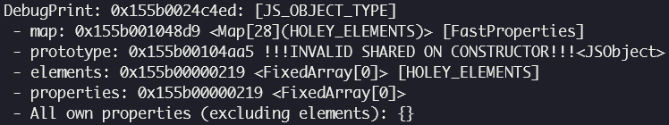

We naturally can define some properties and prototype of the object.

```js
let a = {
    __proto__: Function,
    p1: 1
};
% DebugPrint(a);
```

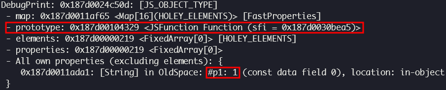

However, in this way which is very clear and intuitive, we have to write duplicated object-defining codes many times if we want to construct many objects with the similar structures. To resolve this drawback, we can use [`class`](https://developer.mozilla.org/docs/Web/JavaScript/Reference/Classes), which plays a role as a template for object.

```js
class A {
    constructor() {
        this.__proto__ = Function;
        this.p1 = 1;
    }
}

let a = new A();
% DebugPrint(a);
```

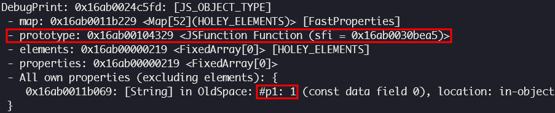

There is [`Reflect.construct()`](https://developer.mozilla.org/docs/Web/JavaScript/Reference/Global_Objects/Reflect/construct) method which does exactly the same with `new`.

```js
class A {
    constructor() {
        this.__proto__ = Function;
        this.p1 = 1;
    }
}

let a = Reflect.construct(A, []);
% DebugPrint(a);
```

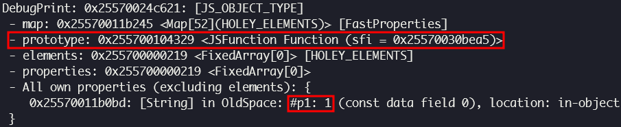

Third argument of `Reflect.construct()`, which is optional `newTarget`, is to be the constructor for prototype of the object. It is basically the same as `target` which is the first argument if we don't provide any. We can access to it in `constructor()` via [`new.target`](https://developer.mozilla.org/docs/Web/JavaScript/Reference/Operators/new.target).

```js
class A {
    constructor() {
        % DebugPrint(new.target);
        this.p1 = 1;
    }
}

let a = Reflect.construct(A, [], Function);
% DebugPrint(a);
```

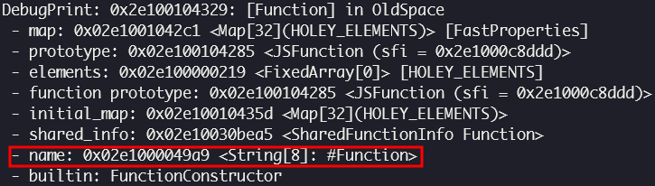

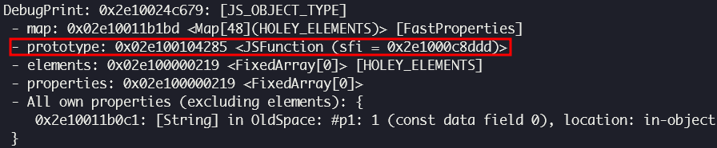

`newTarget` is ignored if `__proto__` is set explicitly in `constructor()`.

```js
class A {
    constructor() {
        % DebugPrint(new.target);
        this.__proto__ = Array;
        this.p1 = 1;
    }
}

let a = Reflect.construct(A, [], Function);
% DebugPrint(a);
```

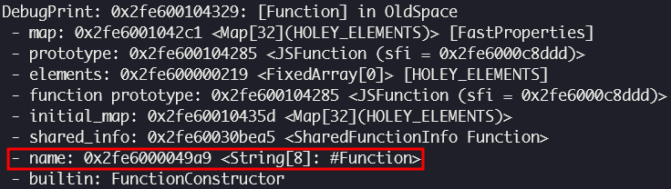

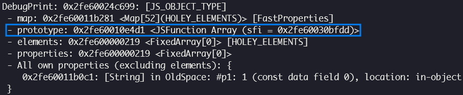

A class can inherit another using [`extends`](https://developer.mozilla.org/docs/Web/JavaScript/Reference/Classes/extends) keyword.

```js
class A {
    constructor() {
        this.p1 = 1;
    }
}

class B extends A {
    constructor() {
        super();
        this.p2 = 2;
    }
}

let b = Reflect.construct(B, []);
% DebugPrint(b);
```

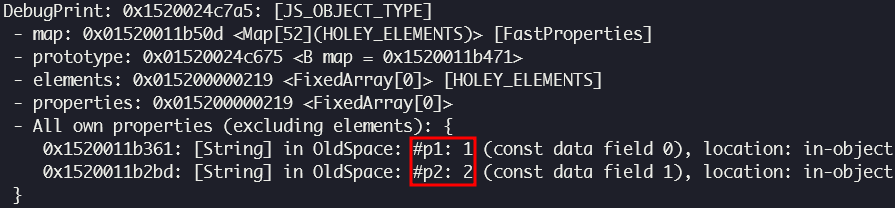

In the relationship of inheritance like above, `B.constructor()` is called derived constructor while `A.constructor()` is called base constructor. A derived constructor can and must call `super()` which is the parent constructor, before it accesses to `this` or returns. With `super()` commented out, we can see the following error:

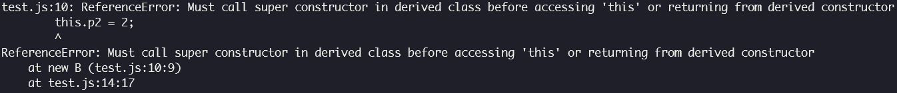

### Optimization for derived constructor by Maglev

Bytecode instruction responsible for constructing an object in derived constructor is `FindNonDefaultConstructorOrConstruct`.

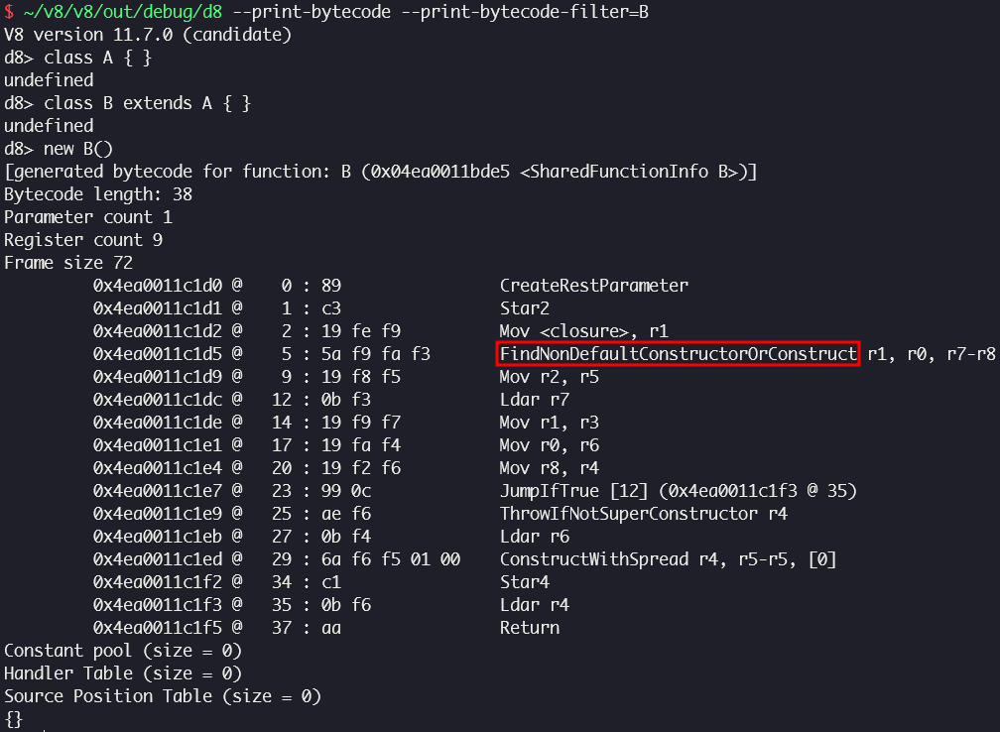

When Maglev compiles a function, `FindNonDefaultConstructorOrConstruct` is handled by [`MaglevGraphBuilder::VisitFindNonDefaultConstructorOrConstruct()`](https://source.chromium.org/chromium/v8/v8/+/7f22404388ef0eb9383f189c1b0a85b5ea93b079:src/maglev/maglev-graph-builder.cc;l=5350). [`this_function`](https://source.chromium.org/chromium/v8/v8/+/7f22404388ef0eb9383f189c1b0a85b5ea93b079:src/maglev/maglev-graph-builder.cc;l=5351) is the function which is being compiled now, and [`current`](https://source.chromium.org/chromium/v8/v8/+/7f22404388ef0eb9383f189c1b0a85b5ea93b079:src/maglev/maglev-graph-builder.cc;l=5359) is the prototype of `this_function`, which means the parent constructor. It [walks up](https://source.chromium.org/chromium/v8/v8/+/7f22404388ef0eb9383f189c1b0a85b5ea93b079:src/maglev/maglev-graph-builder.cc;l=5400) the prototype chain starting from `current` until it encounters a constructor which is [not derived](https://source.chromium.org/chromium/v8/v8/+/7f22404388ef0eb9383f189c1b0a85b5ea93b079:src/maglev/maglev-graph-builder.cc;l=5375). If [`current_function` is a base constructor](https://source.chromium.org/chromium/v8/v8/+/7f22404388ef0eb9383f189c1b0a85b5ea93b079:src/maglev/maglev-graph-builder.cc;l=5381) and [`new_target` is a `JSFunction` object](https://source.chromium.org/chromium/v8/v8/+/7f22404388ef0eb9383f189c1b0a85b5ea93b079:src/maglev/maglev-graph-builder.cc;l=5383), object construction is optimized by [`MaglevGraphBuilder::BuildAllocateFastObject()`](https://source.chromium.org/chromium/v8/v8/+/7f22404388ef0eb9383f189c1b0a85b5ea93b079:src/maglev/maglev-graph-builder.cc;l=5384).

### Root cause

The first argument of `MaglevGraphBuilder::BuildAllocateFastObject()` is a [`FastObject`](https://source.chromium.org/chromium/v8/v8/+/7f22404388ef0eb9383f189c1b0a85b5ea93b079:src/maglev/maglev-graph-builder.cc;l=5385) object which is constructed by `new_target_function`, so this object has [`initial_map`](https://source.chromium.org/chromium/v8/v8/+/7f22404388ef0eb9383f189c1b0a85b5ea93b079:src/maglev/maglev-graph-builder.cc;l=8017) of `new_target_function` as its map. However, the actual constructor for this object is `current_function`, which could be irrelevant with `new_target_function`, so some fields might be uninitialized or initialized to values which are incompatible with the map. This could lead to type confusion.

### Proof of concept

In order to reach the [vulnerable code](https://source.chromium.org/chromium/v8/v8/+/7f22404388ef0eb9383f189c1b0a85b5ea93b079:src/maglev/maglev-graph-builder.cc;l=5384), `new_target_function`, which is the return value of [`MaglevGraphBuilder::TryGetConstant()`](https://source.chromium.org/chromium/v8/v8/+/7f22404388ef0eb9383f189c1b0a85b5ea93b079:src/maglev/maglev-graph-builder.cc;l=5380), has not to be referencing null. [`MaglevGraphBuilder::TryGetConstant()`](https://source.chromium.org/chromium/v8/v8/+/7f22404388ef0eb9383f189c1b0a85b5ea93b079:src/maglev/maglev-graph-builder.cc;l=2234) internally calls [`NodeBase::TryCast<Constant>()`](https://source.chromium.org/chromium/v8/v8/+/7f22404388ef0eb9383f189c1b0a85b5ea93b079:src/maglev/maglev-graph-builder.cc;l=2225), which checks whether the value is constant by calling [`NodeBase::Is<Constant>()`](https://source.chromium.org/chromium/v8/v8/+/7f22404388ef0eb9383f189c1b0a85b5ea93b079:src/maglev/maglev-ir.h;l=1586) before casting the value to `Constant` object. In conclusion, `new_target` has to be a constant node in Maglev graph. If so, there is a guarantee that `new_target` node contains a fixed value, which would be `new_target_function`, then Maglev can optimize object construction for invariable constructor. However, the value which `new_target` contains is basically a function parameter, which generally could never be a constant value. [`var gvar;`](./poc.js#L3) and [`gvar = new.target;`](./poc.js#L8) in [`poc.js`](./poc.js) are used to vault this hurdle by some kind of optimization trick.

Bytecode instruction responsible for storing global property is `StaGlobal`. When Maglev compiles a function, `StaGlobal` is handled by [`MaglevGraphBuilder::VisitStaGlobal()`](https://source.chromium.org/chromium/chromium/src/+/7f22404388ef0eb9383f189c1b0a85b5ea93b079:v8/src/maglev/maglev-graph-builder.cc;l=2961). In case the property is from [`PropertyCell`](https://source.chromium.org/chromium/chromium/src/+/7f22404388ef0eb9383f189c1b0a85b5ea93b079:v8/src/maglev/maglev-graph-builder.cc;l=2917) whose type is [`kConstant`](https://source.chromium.org/chromium/chromium/src/+/7f22404388ef0eb9383f189c1b0a85b5ea93b079:v8/src/maglev/maglev-graph-builder.cc;l=2792), `MaglevGraphBuilder::VisitStaGlobal()` calls [`MaglevGraphBuilder::TryBuildGlobalStore()`](https://source.chromium.org/chromium/chromium/src/+/7f22404388ef0eb9383f189c1b0a85b5ea93b079:v8/src/maglev/maglev-graph-builder.cc;l=2976) → [`MaglevGraphBuilder::TryBuildPropertyCellStore()`](https://source.chromium.org/chromium/chromium/src/+/7f22404388ef0eb9383f189c1b0a85b5ea93b079:v8/src/maglev/maglev-graph-builder.cc;l=2918) → [`MaglevGraphBuilder::BuildCheckValue()`](https://source.chromium.org/chromium/chromium/src/+/7f22404388ef0eb9383f189c1b0a85b5ea93b079:v8/src/maglev/maglev-graph-builder.cc;l=2802) → [`MaglevGraphBuilder::BuildCheckValue()`](https://source.chromium.org/chromium/chromium/src/+/7f22404388ef0eb9383f189c1b0a85b5ea93b079:v8/src/maglev/maglev-graph-builder.cc;l=6746) to insert [`CheckValue`](https://source.chromium.org/chromium/chromium/src/+/7f22404388ef0eb9383f189c1b0a85b5ea93b079:v8/src/maglev/maglev-ir.h;l=4618) node, which [compares](https://source.chromium.org/chromium/chromium/src/+/7f22404388ef0eb9383f189c1b0a85b5ea93b079:v8/src/maglev/maglev-ir.cc;l=2598) [`property_cell_value`](https://source.chromium.org/chromium/chromium/src/+/7f22404388ef0eb9383f189c1b0a85b5ea93b079:v8/src/maglev/maglev-graph-builder.cc;l=2771) with the value which is going to be stored now, and [deoptimizes](https://source.chromium.org/chromium/chromium/src/+/7f22404388ef0eb9383f189c1b0a85b5ea93b079:v8/src/maglev/maglev-ir.cc;l=2599) if they are different.

[`MaglevGraphBuilder::BuildCheckValue()`](https://source.chromium.org/chromium/chromium/src/+/7f22404388ef0eb9383f189c1b0a85b5ea93b079:v8/src/maglev/maglev-graph-builder.cc;l=6722) inserts `CheckValue` by calling [`MaglevGraphBuilder::AddNewNode<CheckValue>()`](https://source.chromium.org/chromium/chromium/src/+/7f22404388ef0eb9383f189c1b0a85b5ea93b079:v8/src/maglev/maglev-graph-builder.cc;l=6737) and calls [`MaglevGraphBuilder::SetKnownValue()`](https://source.chromium.org/chromium/chromium/src/+/7f22404388ef0eb9383f189c1b0a85b5ea93b079:v8/src/maglev/maglev-graph-builder.cc;l=6739). [`MaglevGraphBuilder::SetKnownValue()`](https://source.chromium.org/chromium/chromium/src/+/7f22404388ef0eb9383f189c1b0a85b5ea93b079:v8/src/maglev/maglev-graph-builder.cc;l=3229) adds [`known_info`](https://source.chromium.org/chromium/chromium/src/+/7f22404388ef0eb9383f189c1b0a85b5ea93b079:v8/src/maglev/maglev-graph-builder.cc;l=3233) for `node` to `known_node_aspects()`. `Constant` version of `ref` is set as [`known_info->constant_alternative`](https://source.chromium.org/chromium/chromium/src/+/7f22404388ef0eb9383f189c1b0a85b5ea93b079:v8/src/maglev/maglev-graph-builder.cc;l=3235), which can alter the value of `node` later.

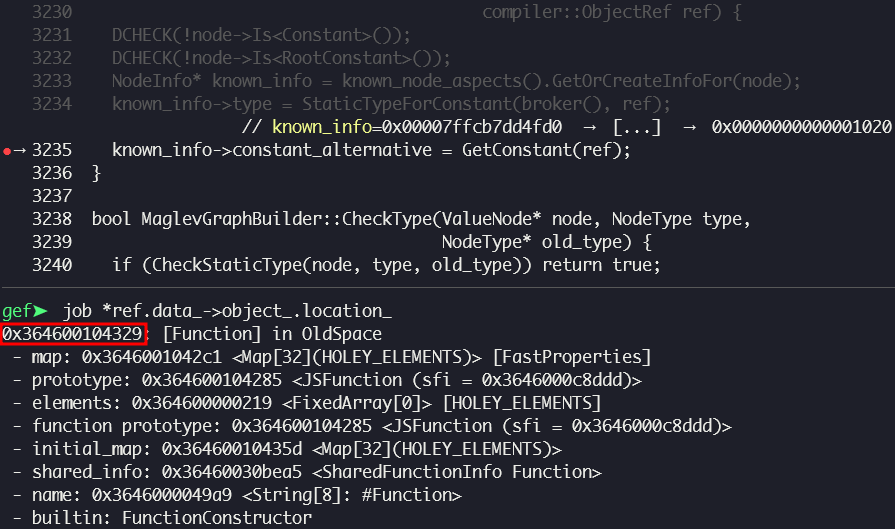

Back to [`MaglevGraphBuilder::TryGetConstant()`](https://source.chromium.org/chromium/chromium/src/+/7f22404388ef0eb9383f189c1b0a85b5ea93b079:v8/src/maglev/maglev-graph-builder.cc;l=2234), it tries to get [`info`](https://source.chromium.org/chromium/chromium/src/+/7f22404388ef0eb9383f189c1b0a85b5ea93b079:v8/src/maglev/maglev-graph-builder.cc;l=2240) for `node` from `known_node_aspects()`. If it succeeds, `MaglevGraphBuilder::TryGetConstant()` returns a `Constant` value stored in `info->constant_alternative`, which would be `new.target` in our case.

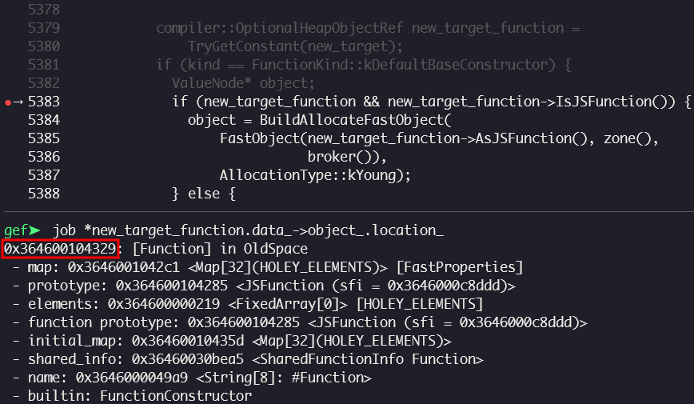

With `--print-maglev-graphs` flag, we can see how generated Maglev graph looks like.

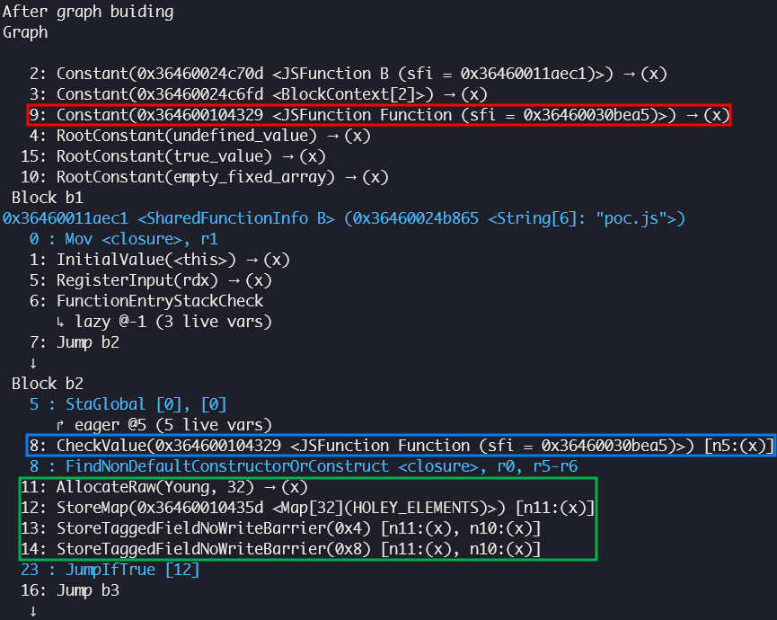

The code in the green box is generated by `MaglevGraphBuilder::BuildAllocateFastObject()`. In this case, we can get an uninitialized `Function` object.

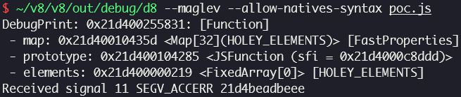

Contradistinctively, with `gvar = new.target;` commented out:

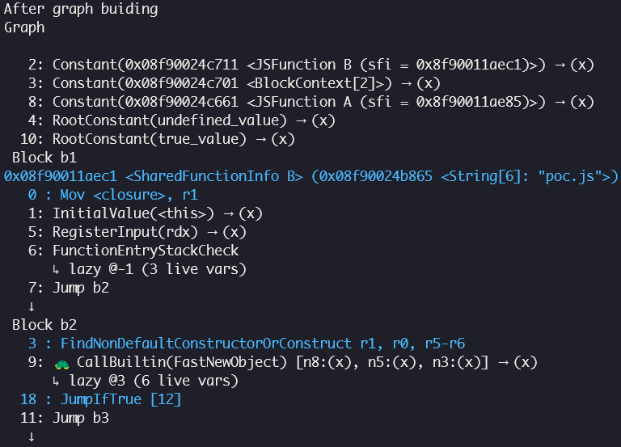

We can see that object construction is not optimized, so the object is generated by `Builtins_FastNewObject()`.

### Patch

> [[maglev] Fix default constructor instantiation](https://chromium.googlesource.com/v8/v8/+/ed93bef7ab786d5367c2ae7882922c23aa0eda64) (Jul 18, 2023)
>
> The new.target may not be in the correct state for fast instantiation.

## References

- [Stable Channel Update for Desktop (Wednesday, August 2, 2023) - Chrome Releases](https://chromereleases.googleblog.com/2023/08/stable-channel-update-for-desktop.html)
- [Security: Type confusion in VisitFindNonDefaultConstructorOrConstruct of Maglev - Chromium Issues](https://issues.chromium.org/issues/40067530)
- [Getting RCE in Chrome with incomplete object initialization in the Maglev compiler - Github Blog](https://github.blog/security/vulnerability-research/getting-rce-in-chrome-with-incomplete-object-initialization-in-the-maglev-compiler/)