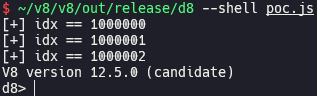
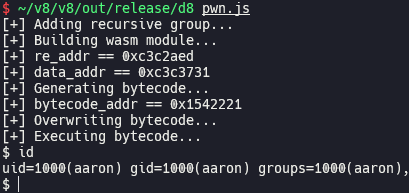

# CVE-2024-2887 (Type Confusion in WebAssembly)

In this post, I will analyze and exploit CVE-2024-2887 which is a Pwn2Own winning type confusion bug in WebAssembly.

## Setup

- Ubuntu 24.04.1 LTS
- [28877c5520793115f8272876a2581b2e5068cffa](https://chromium.googlesource.com/v8/v8/+/28877c5520793115f8272876a2581b2e5068cffa) (Mar 21st, 2024)

Run [`setup.zsh`](./setup.zsh) in your working directory.

## Analysis

### Decoding type section in WebAssembly module

Wasm [module](https://webassembly.github.io/spec/core/binary/modules.html) is consisted of [section](https://webassembly.github.io/spec/core/binary/modules.html#sections)s. [`ModuleDecoderImpl::DecodeModule()`](https://source.chromium.org/chromium/v8/v8/+/28877c5520793115f8272876a2581b2e5068cffa:src/wasm/module-decoder-impl.h;l=1668) is responsible for decoding entire Wasm module, and it calls [`ModuleDecoderImpl::DecodeSection()`](https://source.chromium.org/chromium/v8/v8/+/28877c5520793115f8272876a2581b2e5068cffa:src/wasm/module-decoder-impl.h;l=417) for each section to decode. `ModuleDecoderImpl::DecodeSection()` branches according to [`section_code`](https://source.chromium.org/chromium/v8/v8/+/28877c5520793115f8272876a2581b2e5068cffa:src/wasm/module-decoder-impl.h;l=426) which is the first byte of each section. If `section_code` is [`kTypeSectionCode`](https://source.chromium.org/chromium/v8/v8/+/28877c5520793115f8272876a2581b2e5068cffa:src/wasm/wasm-constants.h;l=96), it means that current section is type section, so [`ModuleDecoderImpl::DecodeTypeSection()`](https://source.chromium.org/chromium/v8/v8/+/28877c5520793115f8272876a2581b2e5068cffa:src/wasm/module-decoder-impl.h;l=621) is called.

`ModuleDecoderImpl::DecodeTypeSection()` [iterates](https://source.chromium.org/chromium/v8/v8/+/28877c5520793115f8272876a2581b2e5068cffa:src/wasm/module-decoder-impl.h;l=625) all types in type section. Each type can be a [recursive type group](https://webassembly.github.io/gc/core/syntax/types.html#recursive-types) or just single type, so two cases are handled separately. [In case of recursive type group](https://source.chromium.org/chromium/v8/v8/+/28877c5520793115f8272876a2581b2e5068cffa:src/wasm/module-decoder-impl.h;l=629), [`module_->types` is extended by `group_size`](https://source.chromium.org/chromium/v8/v8/+/28877c5520793115f8272876a2581b2e5068cffa:src/wasm/module-decoder-impl.h;l=648) and [all types in the group are added to `module_->types`](https://source.chromium.org/chromium/v8/v8/+/28877c5520793115f8272876a2581b2e5068cffa:src/wasm/module-decoder-impl.h;l=654). [In case of single type](https://source.chromium.org/chromium/v8/v8/+/28877c5520793115f8272876a2581b2e5068cffa:src/wasm/module-decoder-impl.h;l=662), [`module_->types` is extended by 1](https://source.chromium.org/chromium/v8/v8/+/28877c5520793115f8272876a2581b2e5068cffa:src/wasm/module-decoder-impl.h;l=665) and [the type is added to `module_->types`](https://source.chromium.org/chromium/v8/v8/+/28877c5520793115f8272876a2581b2e5068cffa:src/wasm/module-decoder-impl.h;l=669).

### Root cause

There are total of three size checks ([1](https://source.chromium.org/chromium/v8/v8/+/28877c5520793115f8272876a2581b2e5068cffa:src/wasm/module-decoder-impl.h;l=623), [2](https://source.chromium.org/chromium/v8/v8/+/28877c5520793115f8272876a2581b2e5068cffa:src/wasm/module-decoder-impl.h;l=635), [3](https://source.chromium.org/chromium/v8/v8/+/28877c5520793115f8272876a2581b2e5068cffa:src/wasm/module-decoder-impl.h;l=637)) when adding new types. These checks are responsible for the size of `module_->types` not to exceed [`kV8MaxWasmTypes`](https://source.chromium.org/chromium/v8/v8/+/28877c5520793115f8272876a2581b2e5068cffa:src/wasm/wasm-limits.h;l=29) which is the maximum number of types in a module.

However, there is no size check when we add single type. Just one recursive type group is enough to set `initial_size` to `kV8MaxWasmTypes`, and `types_count` will be 1 in this case. Then, we can add more types than `kV8MaxWasmTypes`.

### Proof of concept

We add a recursive type group and three types to module in [`poc.js`](./poc.js). `types_count` is 4 because recursive type group is counted as one type, so it passes the first size check. Right after recursive type group is decoded, there are `kV8MaxWasmTypes` types in module, and it's now trying to add another type. It should fail but doesn't, because there is no size check when we add single type. As a result, we can see that the index of last added type is `kV8MaxWasmTypes + 2`, which means that total of `kV8MaxWasmTypes + 3` types are added to module.

### Patch

> [[wasm] Check for type-definition count limit](https://chromium.googlesource.com/v8/v8/+/b852ad701db21d6db5b34e66f4ec1cdccd2ec4d4) (Mar 21st, 2024)

## Exploitation

### Implement exploitation primitives via WebAssembly type confusion

[`RefCast`](https://source.chromium.org/chromium/v8/v8/+/28877c5520793115f8272876a2581b2e5068cffa:src/wasm/function-body-decoder-impl.h;l=5097) instruction casts a Wasm object to certain type. It calls [`IsSameTypeHierarchy()`](https://source.chromium.org/chromium/v8/v8/+/28877c5520793115f8272876a2581b2e5068cffa:src/wasm/wasm-subtyping.cc;l=837) to check if type confusion can occur between `obj.type` and `target_type`. `IsSameTypeHierarchy()` calls [`NullSentinelImpl()`](https://source.chromium.org/chromium/v8/v8/+/28877c5520793115f8272876a2581b2e5068cffa:src/wasm/wasm-subtyping.cc;l=99) for each type, and returns `true` if the return values are the same.

Type casting is proceeded after the check is passed. Among the three cases, we focuses to the case that [`TypeCheckAlwaysSucceeds()` returns `true`](https://source.chromium.org/chromium/v8/v8/+/28877c5520793115f8272876a2581b2e5068cffa:src/wasm/function-body-decoder-impl.h;l=5141), because [`WasmGraphBuildingInterface::Forward()`](https://source.chromium.org/chromium/v8/v8/+/28877c5520793115f8272876a2581b2e5068cffa:src/wasm/graph-builder-interface.cc;l=2180) which completes type casting without any other type check is called in that case.

[`TypeCheckAlwaysSucceeds()`](https://source.chromium.org/chromium/v8/v8/+/28877c5520793115f8272876a2581b2e5068cffa:src/wasm/function-body-decoder-impl.h;l=4673) internally calls [`IsSubtypeOf()`](https://source.chromium.org/chromium/v8/v8/+/28877c5520793115f8272876a2581b2e5068cffa:src/wasm/wasm-subtyping.h;l=74) which checks if `subtype` is a subtype of `supertype`, which means that `subtype` always can be casted to `supertype`. `IsSubtypeOf()` calls [`IsSubtypeOfImpl()`](https://source.chromium.org/chromium/v8/v8/+/28877c5520793115f8272876a2581b2e5068cffa:src/wasm/wasm-subtyping.cc;l=253) which returns `true` for many `supertype` including `HeapType::kArray`, `HeapType::kStruct`, etc., if [`subtype` is `HeapType::kNone`](https://source.chromium.org/chromium/v8/v8/+/28877c5520793115f8272876a2581b2e5068cffa:src/wasm/wasm-subtyping.cc;l=329).

Heap types of Wasm module are reserving the [indices](https://source.chromium.org/chromium/v8/v8/+/28877c5520793115f8272876a2581b2e5068cffa:src/wasm/value-type.h;l=61) starting from `kV8MaxWasmTypes`. We can overwrite reserved index for [`HeapType::kNone`](https://source.chromium.org/chromium/v8/v8/+/28877c5520793115f8272876a2581b2e5068cffa:src/wasm/value-type.h;l=77) with arbitrary type using the bug. Then we can cast this type to any other type which is supertype of `HeapType::kNone`.

We can implement `addrof` primitive by casting JavaScript object to `int`, and sandboxed AAR/AAW primitives by casting `int` to `int *` and dereferencing it.

### Escape V8 sandbox to get RCE

> [Escaping V8 Sandbox via RegExp Bytecode (Chromium < 125.0.6422.60)](https://aaronsjcho.github.io/Escaping-V8-Sandbox-via-RegExp-Bytecode/)

[`pwn.js`](./pwn.js)

## References

- [Stable Channel Update for Desktop (Tuesday, March 26, 2024) - Chrome Releases](https://chromereleases.googleblog.com/2024/03/stable-channel-update-for-desktop_26.html)
- [[Pwn2Own 2024] wasm type confusion from insufficient type section validation - Chromium Issues](https://issues.chromium.org/issues/330588502)
- [CVE-2024-2887: A Pwn2Own Winning Bug in Google Chrome - Zero Day Initiative](https://www.zerodayinitiative.com/blog/2024/5/2/cve-2024-2887-a-pwn2own-winning-bug-in-google-chrome)
- [CVE-2024-2887 - rycbar77 (Github)](https://github.com/rycbar77/CVE-2024-2887)
