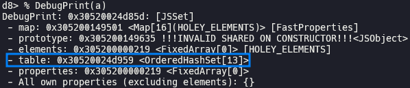

# Issue 40069798 (Type Confusion in V8)

In this post, I will analyze and exploit [Issue 40069798](https://issues.chromium.org/issues/40069798). Even though this is a type confusion bug which leads to RCE, no CVE number was assigned to this bug because it was living in experimental feature and only could be triggered under `--harmony` or `--harmony-set-methods` flag in V8.

## Setup

- Ubuntu 22.04.5 LTS
- [f118dd45b7cde0d320e022068f0e98dbc53b2ba9](https://chromium.googlesource.com/v8/v8/+/f118dd45b7cde0d320e022068f0e98dbc53b2ba9) (Aug 17th, 2023)

Run [`setup.zsh`](./setup.zsh) in your working directory.

## Analysis

### ECMAScript Harmony

> [ECMAScript - Wikipedia](https://en.wikipedia.org/wiki/ECMAScript)
>
> ECMAScript (ES) is a standard for scripting languages, including JavaScript, JScript, and ActionScript. It is best known as a JavaScript standard intended to ensure the interoperability of web pages across different web browsers. It is standardized by [Ecma International](https://ecma-international.org/) in the document [ECMA-262](https://ecma-international.org/publications-and-standards/standards/ecma-262/).

The first edition of ECMA-262 was published in June 1997, and it is being published in June every year from 6th edition which is published on June 2015.

> [Ecma International approves major revision of ECMAScript - Ecma International](https://ecma-international.org/news/ecma-international-approves-major-revision-of-ecmascript/)
>
> The last major revision of the ECMAScript standard was the Third Edition, published in 1999. After completion of the Third Edition, significant work was done to develop a Fourth Edition. Although development of a Fourth Edition was not completed, that work influenced ECMAScript, Fifth Edition and is continuing to influence the ongoing development of ECMAScript. Work on future ECMAScript editions continues as part of the previously announced ECMAScript Harmony project.

We can use Harmony features in V8 by enabling run-time option `--harmony`, etc.


### Set

[`Set`](https://developer.mozilla.org/docs/Web/JavaScript/Reference/Global_Objects/Set) is a collection of unique values.


Elements of [`JSSet`](https://source.chromium.org/chromium/v8/v8/+/f118dd45b7cde0d320e022068f0e98dbc53b2ba9:src/objects/js-collection.h;l=31) object are stored in [`OrderedHashSet`](https://source.chromium.org/chromium/v8/v8/+/f118dd45b7cde0d320e022068f0e98dbc53b2ba9:src/objects/ordered-hash-table.h;l=267), which is [`OrderedHashTable`](https://source.chromium.org/chromium/v8/v8/+/f118dd45b7cde0d320e022068f0e98dbc53b2ba9:src/objects/ordered-hash-table.h;l=67) whose `entrysize` is 1.


`Set` has following [set composition methods](https://developer.mozilla.org/docs/Web/JavaScript/Reference/Global_Objects/Set#set_composition), which figure out the relationship with another `Set`.

- [`difference()`](https://source.chromium.org/chromium/v8/v8/+/f118dd45b7cde0d320e022068f0e98dbc53b2ba9:src/builtins/set-difference.tq;l=8)
- [`intersection()`](https://source.chromium.org/chromium/v8/v8/+/f118dd45b7cde0d320e022068f0e98dbc53b2ba9:src/builtins/set-intersection.tq;l=8)
- [`symmetricDifference()`](https://source.chromium.org/chromium/v8/v8/+/f118dd45b7cde0d320e022068f0e98dbc53b2ba9:src/builtins/set-symmetric-difference.tq;l=8)
- [`union()`](https://source.chromium.org/chromium/v8/v8/+/f118dd45b7cde0d320e022068f0e98dbc53b2ba9:src/builtins/set-union.tq;l=8)
- [`isDisjointFrom()`](https://source.chromium.org/chromium/v8/v8/+/f118dd45b7cde0d320e022068f0e98dbc53b2ba9:src/builtins/set-is-disjoint-from.tq;l=8)
- [`isSubsetOf()`](https://source.chromium.org/chromium/v8/v8/+/f118dd45b7cde0d320e022068f0e98dbc53b2ba9:src/builtins/set-is-subset-of.tq;l=8)
- [`isSupersetOf()`](https://source.chromium.org/chromium/v8/v8/+/f118dd45b7cde0d320e022068f0e98dbc53b2ba9:src/builtins/set-is-superset-of.tq;l=8)

### Root cause

Every methods of `Set` start with following code in common.

```c++
  // 1. Let O be the this value.
  // 2. Perform ? RequireInternalSlot(O, [[SetData]]).
  const o = Cast<JSSet>(receiver) otherwise
  ThrowTypeError(
      MessageTemplate::kIncompatibleMethodReceiver, methodName, receiver);

  const table = Cast<OrderedHashSet>(o.table) otherwise unreachable;

  // 3. Let otherRec be ? GetSetRecord(other).
  let otherRec = GetSetRecord(other, methodName);
```

They call [`GetSetRecord()`](https://source.chromium.org/chromium/v8/v8/+/f118dd45b7cde0d320e022068f0e98dbc53b2ba9:src/builtins/collections.tq;l=252) to get `otherRec` which is iterator of `other`, after getting `table` of `receiver`. `GetSetRecord()` internally [calls `GetProperty()`](https://source.chromium.org/chromium/v8/v8/+/f118dd45b7cde0d320e022068f0e98dbc53b2ba9:src/builtins/collections.tq;l=259) to get `size` property of `other`.  We can let arbitrary JavaScript code be executed at this point, by redefining `size` property of `other` as a getter. If we make table of `receiver` to be grown or shrunk by adding or deleting element, new table is allocated and its address is stored in the size field of old table. However, corrupted old `table` is used as it is after `GetSetRecord()` is returned. This can cause type confusion.

### Proof of concept

Calling any method except for `union()` in [`poc1.js`](./poc1.js) lets `DCHECK` fail.


In case of `union()`, corrupted `table` becomes [`resultSetData`](https://source.chromium.org/chromium/v8/v8/+/f118dd45b7cde0d320e022068f0e98dbc53b2ba9:src/builtins/set-union.tq;l=25), and it is [stored in a new `Set`](https://source.chromium.org/chromium/v8/v8/+/f118dd45b7cde0d320e022068f0e98dbc53b2ba9:src/builtins/set-union.tq;l=95) which is returned by `union()`. In [`poc2.js`](./poc2.js), There is the address of table of `a` in the size field of table of `u`.




`u.size` gets the value stored in the size field of table, so we can directly access to table of `a`, which is an `OrderedHashSet` object.


### Bisection

> [[set-methods] Add feature flag and union method](https://chromium.googlesource.com/v8/v8/+/833b8fa25f10a0f0d6811eff7fc33b6565686785) (May 30th, 2023)
>
> [[set-methods] Add intersection to set methods](https://chromium.googlesource.com/v8/v8/+/16f20e1e3658f2089b57cdfa5eb810ab2558ca3d) (Jun 14th, 2023)
>
> [[set-methods] Add difference to set methods](https://chromium.googlesource.com/v8/v8/+/e2b55e6dd502112088a289de178b6c962fa76793) (Jun 23rd, 2023)
>
> [[set-methods] Add symmetricDifference](https://chromium.googlesource.com/v8/v8/+/4cecaac95f960f4be3c0a731f677a5eff396bc92) (Jun 28th, 2023)
>
> [[set-methods] Add isSubsetOf method](https://chromium.googlesource.com/v8/v8/+/8672781f10d94f9d41ac66be3bd7d030d7054846) (Jul 27th, 2023)
>
> [[set-methods] Add isSupersetOf method](https://chromium.googlesource.com/v8/v8/+/808c766d70faa8f3b22f6d83405fb094991e0908) (Jul 28th, 2023)
>
> [[set-methods] Add isDisjointFrom to set methods](https://chromium.googlesource.com/v8/v8/+/3a70996b932030ab030347b039f92bab27270783) (Aug 1st, 2023)

The bug has been existed since each Set method was added.

### Patch

> [[set-methods]Getting other before receiver's table](https://chromium.googlesource.com/v8/v8/+/9e0005d745067c5dab681d9c95483bc71c317e2d) (Aug 18th, 2023)
>
> This CL fix the issue of clearing receiver in case of having user arbitraty code in the `other`.

## Exploitation

### Generate fake object

We can increase or decrease the value stored in the size field of corrupted table by adding or deleting elements. It means that we can control the address of the object which we can get by `u.size` in `poc2.js`. As a result, we can get fake object at the address.

### Implement sandboxed AAR/AAW primitive

We don't have any leak, but still we can generate [`float_arr`](./pwn.js#L53) which is fake array of float numbers, because both of [`map`](./pwn.js#L29) and [`properties`](./pwn.js#L30) are almost constants. We can set [`elements`](./pwn.js#L31) to arbitrary address, then we can access to the address and read or write value. These would be sandboxed [AAR](./pwn.js#L56)/[AAW](./pwn.js#L62) primitives.

### Implement addrof primitive

Now we can read or write value at arbitrary address, but we don't know where to read or write because we still don't have any leak.

The address of JavaScript object is random, but memory region for JavaScript objects stands still.


We can insert a [marker](./pwn.js#L68) to the `float_arr_struct`, and scan for this region to find it. If we meet the marker while scanning, we can calculate the address of `float_arr`.

However, if we scan for full memory region, our exploitation is gonna be broken because of garbage collection. We can experientially know that the address of any object is never lower than certain value, `0x4e000` in my case, so we can just start scanning from there.

If we define `float_arr_struct` and [`obj_arr`](./pwn.js#L41) consecutively in `size` getter, we can calculate the address of `obj_arr` using the address of `float_arr` which we found by scanning for memory, because the distance between them is invariant. Then, reading `obj_arr[0]` using sandboxed AAR primitive, we can get the address of the object stored in `obj_arr[0]` as a float number. This would be [`addrof`](./pwn.js#L79) primitive.

### Escape V8 sandbox to get RCE

> [Escaping V8 Sandbox via WebAssembly JIT Spraying: Part 2 (110.0.5481.77 <= Chromium < 122.0.6261.57)](https://aaronsjcho.github.io/Escaping-V8-Sandbox-via-WebAssembly-JIT-Spraying-Part-2/)

[`shellcode.py`](./shellcode.py) [`pwn.wat`](./pwn.wat) [`wasm.py`](./wasm.py)

```zsh
~/wabt/bin/wat2wasm pwn.wat # output: pwn.wasm
python3 wasm.py # output: [0x0, 0x61, 0x73, 0x6d, 0x1, 0x0, 0x0, 0x0, 0x1, 0x4, 0x1, 0x60, 0x0, 0x0, 0x3, 0x2, 0x1, 0x0, 0x7, 0x8, 0x1, 0x4, 0x6d, 0x61, 0x69, 0x6e, 0x0, 0x0, 0xa, 0xb1, 0x1, 0x1, 0xae, 0x1, 0x0, 0x42, 0xc8, 0xe2, 0x80, 0x86, 0x89, 0x92, 0xe4, 0xf5, 0x2, 0x42, 0xe6, 0xf0, 0xb2, 0x9b, 0x86, 0x8a, 0xe4, 0xf5, 0x2, 0x42, 0xb8, 0xdf, 0xe0, 0x9b, 0x96, 0x8c, 0xe4, 0xf5, 0x2, 0x42, 0xc8, 0x82, 0x83, 0x87, 0x82, 0x92, 0xe4, 0xf5, 0x2, 0x42, 0xc8, 0x8a, 0xbc, 0x91, 0x96, 0xcd, 0xdb, 0xf5, 0x2, 0x42, 0xd0, 0x90, 0xa5, 0xbc, 0x8e, 0x92, 0xe4, 0xf5, 0x2, 0x42, 0xc8, 0xe2, 0xd8, 0x87, 0x89, 0x92, 0xe4, 0xf5, 0x2, 0x42, 0x90, 0x91, 0xc5, 0x81, 0x8c, 0x92, 0xe4, 0xf5, 0x2, 0x42, 0xe6, 0xf0, 0xea, 0x81, 0x83, 0x8a, 0xe4, 0xf5, 0x2, 0x42, 0xb8, 0x99, 0x85, 0xca, 0xd5, 0x87, 0xe4, 0xf5, 0x6, 0x42, 0x90, 0x91, 0x85, 0x86, 0x8e, 0x84, 0xe4, 0xf5, 0x6, 0x42, 0xc8, 0x8a, 0x90, 0xca, 0xb4, 0x8a, 0xd4, 0xf5, 0x6, 0x42, 0xd0, 0x90, 0xa5, 0x84, 0x8e, 0x92, 0xe4, 0xf5, 0x6, 0x42, 0xc8, 0xe2, 0xec, 0x9e, 0x85, 0x8a, 0xe4, 0xf5, 0x6, 0x42, 0xc8, 0x92, 0x8a, 0x87, 0x89, 0x92, 0xe4, 0xf5, 0x6, 0x42, 0xc8, 0xe2, 0x80, 0x86, 0xbb, 0x87, 0xe4, 0xf5, 0x6, 0x42, 0x8f, 0x8a, 0xc0, 0x84, 0x89, 0x92, 0xa4, 0xc8, 0x90, 0x7f, 0xf, 0xb]
```

You have to install `/bin/xcalc` by running `sudo apt install -y x11-apps` before executing [`pwn.js`](./pwn.js) if you are using WSL.


## References

- [Security: CSA_DCHECK failed: Torque assert 'Is\<A\>(o)' failed - Chromium Issues](https://issues.chromium.org/issues/40069798)
