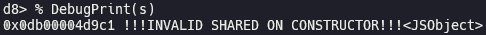
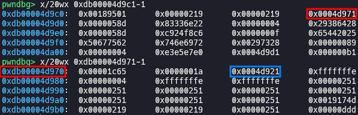
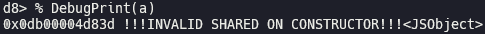
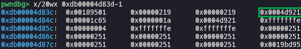
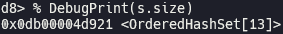
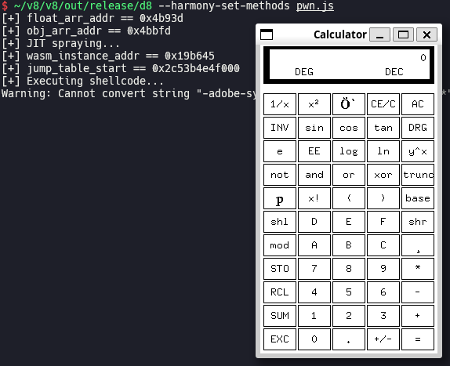

# Issue 41483297 (Type Confusion in V8)

One day, I noticed that [Issue 40069798](https://issues.chromium.org/issues/40069798) which was a type confusion bug in V8 was disclosed. This bug was awarded $15,000 for renderer RCE, but no CVE number was assigned because it was living in experimental feature and only could be triggered under `--harmony` or `--harmony-set-methods` flag in V8. While studying this bug, I tried fuzzing targeting Harmony Set methods in which it was living, with a light heart. Not long after, I unexpectedly got a same `DCHECK` failing crash, and could successfully achieve RCE in the same way. In this post, I will analyze and exploit my bug, [Issue 41483297](https://issues.chromium.org/issues/41483297).

Before reading, I recommend you to read [my post for Issue 40069798](https://aaronsjcho.github.io/Issue-40069798/) first, because I will omit many overlapping contents in here.

## Setup

- Ubuntu 22.04.5 LTS
- [1976a3f375fb686a12d0577b0a01b164d8481414](https://chromium.googlesource.com/v8/v8/+/1976a3f375fb686a12d0577b0a01b164d8481414) (Dec 12th, 2023)

Run [`setup.zsh`](./setup.zsh) in your working directory.
## Analysis

### Root cause

[`Set.prototype.symmetricDifference()`](https://developer.mozilla.org/docs/Web/JavaScript/Reference/Global_Objects/Set/symmetricDifference) method is handled by [`SetPrototypeSymmetricDifference()`](https://source.chromium.org/chromium/v8/v8/+/1976a3f375fb686a12d0577b0a01b164d8481414:src/builtins/set-symmetric-difference.tq;l=8). It calls [`GetKeysIterator()`](https://source.chromium.org/chromium/v8/v8/+/1976a3f375fb686a12d0577b0a01b164d8481414:src/builtins/collections.tq;l=311) to get [`keysIter`](https://source.chromium.org/chromium/v8/v8/+/1976a3f375fb686a12d0577b0a01b164d8481414:src/builtins/set-symmetric-difference.tq;l=25) which is iterator of `other`, after getting [`table`](https://source.chromium.org/chromium/v8/v8/+/1976a3f375fb686a12d0577b0a01b164d8481414:src/builtins/set-symmetric-difference.tq;l=22) of `receiver`. `GetKeysIterator()` internally [calls](https://source.chromium.org/chromium/v8/v8/+/1976a3f375fb686a12d0577b0a01b164d8481414:src/builtins/collections.tq;l=315) [`keys()`](https://developer.mozilla.org/docs/Web/JavaScript/Reference/Global_Objects/Set/keys) method of `other`. We can let arbitrary JavaScript code be executed at this point, by redefining `keys()` method of `other`. If we make table of `receiver` to be grown or shrunk by adding or deleting element, new table is allocated and its address is stored in the size field of old table. However, corrupted old `table` is used as it is after `GetKeysIterator()` is returned. It is [set to table of  new `Set`](https://source.chromium.org/chromium/v8/v8/+/1976a3f375fb686a12d0577b0a01b164d8481414:src/builtins/set-symmetric-difference.tq;l=122) which is returned to us, going through [`resultSetData`](https://source.chromium.org/chromium/v8/v8/+/1976a3f375fb686a12d0577b0a01b164d8481414:src/builtins/set-symmetric-difference.tq;l=29), [`resultAndNumberOfElements.setData`](https://source.chromium.org/chromium/v8/v8/+/1976a3f375fb686a12d0577b0a01b164d8481414:src/builtins/set-symmetric-difference.tq;l=32), and [`shrunk`](https://source.chromium.org/chromium/v8/v8/+/1976a3f375fb686a12d0577b0a01b164d8481414:src/builtins/set-symmetric-difference.tq;l=115). This can cause type confusion.

### Proof of concept

[`poc.js`](./poc.js)









We can see that the address of table of `a` (green box) is stored in the size field of table of `s` (blue box). Thus, we can get an `OrderedHashSet` object which is table of `a`, by reading `s.size`.



### Bisection

> [[set-methods]Getting other before receiver's table](https://chromium.googlesource.com/v8/v8/+/9e0005d745067c5dab681d9c95483bc71c317e2d) (Aug 18th, 2023)
>
> This CL fix the issue of clearing receiver in case of having user arbitraty code in the `other`.

The bug has been existed since `symmetricDifference()` method was added, but was exposed when the previous bug was patched in the commit above.

### Patch

> [[set-methods]Get receiver's table after other's keys()](https://chromium.googlesource.com/v8/v8/+/4d0ea4aac11c66481e0bf6c2b1e9308a1b442aff) (Dec 12th, 2023)
>
> This CL fixes the issue of clearing receiver's table in case of having user's arbitrary code in other's keys().

## Exploitation

[`shellcode.py`](./shellcode.py) [`pwn.wat`](./pwn.wat) [`wasm.py`](./wasm.py)

```zsh
~/wabt/bin/wat2wasm pwn.wat # output: pwn.wasm
python3 wasm.py # output: [0x0, 0x61, 0x73, 0x6d, 0x1, 0x0, 0x0, 0x0, 0x1, 0x4, 0x1, 0x60, 0x0, 0x0, 0x3, 0x2, 0x1, 0x0, 0x7, 0x8, 0x1, 0x4, 0x6d, 0x61, 0x69, 0x6e, 0x0, 0x0, 0xa, 0xb1, 0x1, 0x1, 0xae, 0x1, 0x0, 0x42, 0xc8, 0xe2, 0x80, 0x86, 0x89, 0x92, 0xe4, 0xf5, 0x2, 0x42, 0xe6, 0xf0, 0xb2, 0x9b, 0x86, 0x8a, 0xe4, 0xf5, 0x2, 0x42, 0xb8, 0xdf, 0xe0, 0x9b, 0x96, 0x8c, 0xe4, 0xf5, 0x2, 0x42, 0xc8, 0x82, 0x83, 0x87, 0x82, 0x92, 0xe4, 0xf5, 0x2, 0x42, 0xc8, 0x8a, 0xbc, 0x91, 0x96, 0xcd, 0xdb, 0xf5, 0x2, 0x42, 0xd0, 0x90, 0xa5, 0xbc, 0x8e, 0x92, 0xe4, 0xf5, 0x2, 0x42, 0xc8, 0xe2, 0xd8, 0x87, 0x89, 0x92, 0xe4, 0xf5, 0x2, 0x42, 0x90, 0x91, 0xc5, 0x81, 0x8c, 0x92, 0xe4, 0xf5, 0x2, 0x42, 0xe6, 0xf0, 0xea, 0x81, 0x83, 0x8a, 0xe4, 0xf5, 0x2, 0x42, 0xb8, 0x99, 0x85, 0xca, 0xd5, 0x87, 0xe4, 0xf5, 0x6, 0x42, 0x90, 0x91, 0x85, 0x86, 0x8e, 0x84, 0xe4, 0xf5, 0x6, 0x42, 0xc8, 0x8a, 0x90, 0xca, 0xb4, 0x8a, 0xd4, 0xf5, 0x6, 0x42, 0xd0, 0x90, 0xa5, 0x84, 0x8e, 0x92, 0xe4, 0xf5, 0x6, 0x42, 0xc8, 0xe2, 0xec, 0x9e, 0x85, 0x8a, 0xe4, 0xf5, 0x6, 0x42, 0xc8, 0x92, 0x8a, 0x87, 0x89, 0x92, 0xe4, 0xf5, 0x6, 0x42, 0xc8, 0xe2, 0x80, 0x86, 0xbb, 0x87, 0xe4, 0xf5, 0x6, 0x42, 0x8f, 0x8a, 0xc0, 0x84, 0x89, 0x92, 0xa4, 0xc8, 0x90, 0x7f, 0xf, 0xb]
```

You have to install `/bin/xcalc` by running `sudo apt install -y x11-apps` before executing [`pwn.js`](./pwn.js) if you are using WSL.



## References

- [Security: Type confusion in Harmony Set methods (Leads to RCE) - Chromium Issues](https://issues.chromium.org/issues/41483297)
